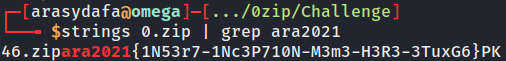

# 0zip

## Deskripsi
PT Pama Persada sedang melakukan pengeboran untuk mendapatkan mineral di lokasi penemuan mineral terbaru mereka. Seorang engineer nya lalu berkata: We need to go deeper...

## Solusi
Diketahui suatu file dengan ekstensi zip bernama 0.zip. Ketika melakukan ekstrak pada file zip tersebut terdapat file zip lagi (nested zip) dengan nama file angka 1 dan seterusnya. Dari sini dapat digunakan perintah ```strings 0.zip | grep ara2021``` untuk mengecek strings apa saja yang terdapat di file tersebut. Ternyata didapatkan hasil seperti berikut.



```46.zipara2021{1N53r7-1Nc3P710N-M3m3-H3R3-3TuxG6}PK```. Ambil hasil strings sesuai dengan format flag yang ada dan didapatkan flagnya.

## Flag
### ara2021{1N53r7-1Nc3P710N-M3m3-H3R3-3TuxG6}