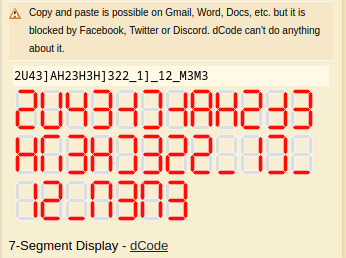

# Help

## Description
Bob is receiving a message from their clients, to put this text on the display in the office. Bob is confused because he didn't know what it is, can you help him?

Format: ARA2023{lowercase_flag}

[Attachment](./Challenge/help.txt)

## Solution
We got a text file that is likely written in binary format, but if we count it there are only 7 bit instead of 8 bit. It turns out that the number of 0 and 1 is representing a 7-segment display (assuming from the description of this challenge that mentioned display). To decode this message we use this [dCode](https://www.dcode.fr/7-segment-display), but the result is like this.

If we looked at it, the characters that show the 7-segment display is reversed. In this case, we need to reverse the `help.txt` and try to decode it again.

After decoding, we got a text supertranscendentess_it_is_hehe. So the flag is ARA2023{supertranscendentess_it_is_hehe}

## Flag
`ARA2023{supertranscendentess_it_is_hehe}`
