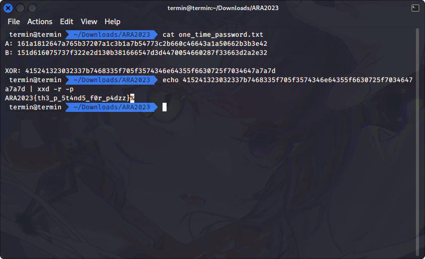

# One Time Password (?)

## Description

bwoah, some innovative challenges

File : https://drive.google.com/file/d/1lf1gac5VEmJOGRu9CkkO-CakRcyzEj2K/view?usp=share_link

## Solution

This challenge might be tricky if you try to overthink about it, but its easier than how its looks like. Convert the `XOR` hex encoded value to ASCII to get the flag.

## Flag
`ARA2023{th3_p_5t4nd5_f0r_p4dzz}`
