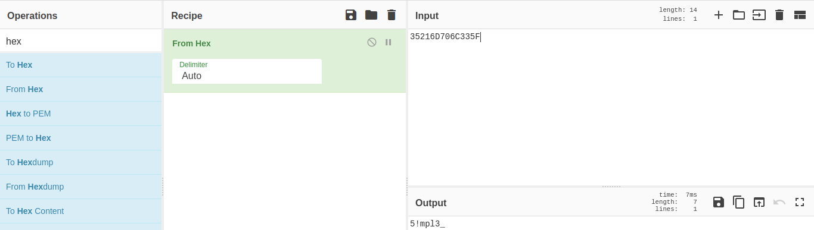
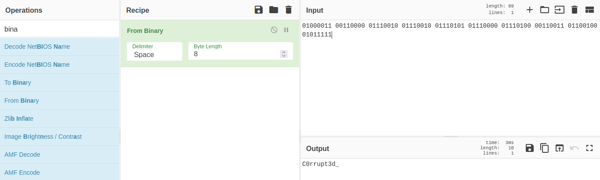
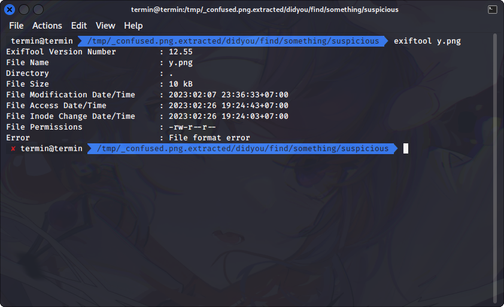
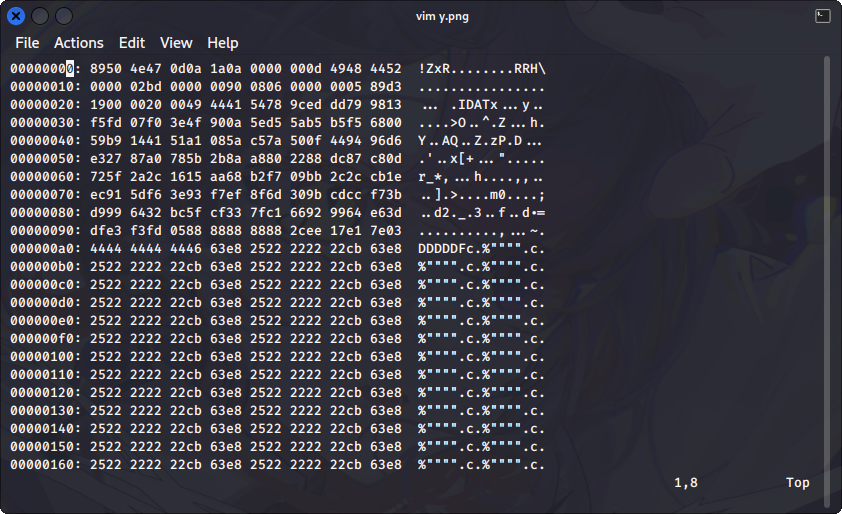
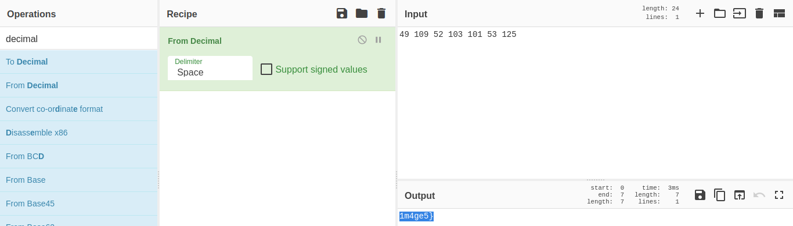

# Thinker

## Deskripsi
I always overthink about finding other part of myself, can you help me?

[Attachments](./Challenge/confused.png)

## Solusi

File yang diberikan merupakan file png yang bila di extract menggunakan binwalk terdapat beberapa file lagi di dalamnya.

``` shell
binwalk -e confused.png
```


Setelah di ekstrak menggunakan binwalk akan didapatkan struktur direktori seperti berikut ini.

``` shell
.
├── 181A
├── 181A.zlib
├── 4E89D.zip
└── didyou
    ├── e.txt
    └── find.zip
```

Pada direktori didyou terdapat file e.txt yang berisikan teks yang telah di encode menggunakan base64 dan jika di decode didapatkan hasil berikut.

``` shell
$ cat e.txt | base64 -d
ARA2023{
```

Selanjutnya di dalam direktori tersebut terdapat juga file find.zip. Jika di extract di dalamnya terdapat file a.txt yang berisi kode hex. Digunakan [CyberChef](https://gchq.github.io/CyberChef/) untuk mengkonversi hex ke ASCII.



Di dalam direktori didyou/find terdapat juga file something.zip. Ketika di extract terdapat file s.txt yang berisikan teks binary. Jika dikonversikan ke ASCII menjadi seperti ini.



Kemudian di dalam direktori didyou/find/something/ terdapat file suspicious.zip. Jika di extract terdapat file png. File tersebut tidak bisa dibuka dan jika dicek menggunakan exiftool terdapat file format error.



Dengan menggunakan vim dicoba untuk mengecek hex dari file png tersebut. File signature png sudah rusak, merujuk pada [Wikipedia](https://en.wikipedia.org/wiki/PNG#File_format) kerusakan terdapat pada byte 0-3 yang merupakan signature file PNG dan byte 12-15 terdapat kerusakan pada chunk IHDR.


Data hex yang telah diperbaiki seperti berikut ini.



Setelah selesai diperbaiki, file png tersebut berisi bilangan desimal. Jika dikonversikan menjadi ASCII didapat hasil berikut.



## Flag
### ARA2023{5!mpl3_C0rrupt3d_1m4ge5}

