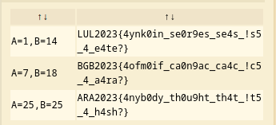

# @B4SH

## Description

Ailee had just moved out to a boarding house in the countryside to escape the fast-paced and hectic city life. She was very excited to start her life with a new environment, she was very happy before she found out that the room she rented was very dark. Suddenly she found out 2 strange papers on the wall behind the door that says:

"5A495A323032337B346D62793077625F677330663973675F677334675F2167355F345F733468733F7D".

Help Ailee to find what's behind the text written on the paper.

## Solution
The message in the challenge description is looks like hex encoded message. Let's convert it from hex to ASCII and the results are as follows.

``` shell
$ echo 5A495A323032337B346D62793077625F677330663973675F677334675F2167355F345F733468733F7D | xxd -r -p
ZIZ2023{4mby0wb_gs0f9sg_gs4g_!g5_4_s4hs?}
```

The decoded message is still doesn't match the flag format. At first, I thought this message is enciphered using Caesar cipher, but after bruteforce the right shift I can't find the correct answer. It turns out that the message is enciphered using Affine cipher, I used [dCode](https://www.dcode.fr/affine-cipher) to decipher the message and got the flag.



## Flag
`ARA2023{4nyb0dy_th0u9ht_th4t_!t5_4_h4sh?}`
