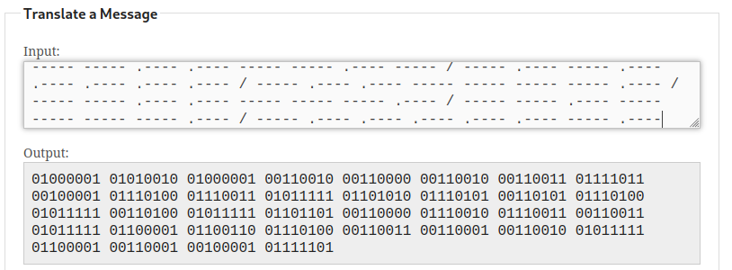

# D0ts N D4sh3s

## Deskripsi
Albert was lost in a deep forest surrounded by a sea and tried to escape by sending a SOS signal containing a code.

Jack who works at a lighthouse realized that someone was sending a SOS signal and responses as fast as he can.

What do you think Albert tries to say?

Chall File : https://drive.google.com/file/d/1h5ht0z64ChQ3v28o9Uq-GI0Uk21camH2/view?usp=sharing

## Solusi

Ketika file soal dibuka ternyata merupakan sebuah sandi morse. Digunakan [Morse Code](https://morsecode.world/international/translator.html) untuk memecahkan sandi morse tersebut. Didapatkan hasil berupa bilangan biner.

Selanjutnya digunakan [CyberChef](https://gchq.github.io/CyberChef/) untuk mengkonversi bilangan biner tersebut ke ASCII.

## Flag
### ARA2023{!ts_ju5t_4_m0rs3_aft312_a1!}