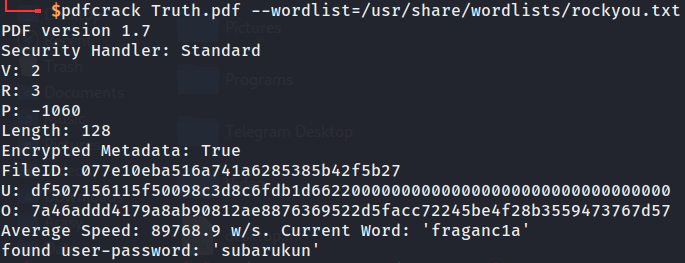

# Truth

## Deskripsi

Kuronushi traveled far away from his country to learn something about himself. He never sure about his identity. Untill One day, he met a sage who gave him a book of truth. The sage said " To understand about yourself,Erase the title and find the Bigger case"

Submit the flag on this format ARA2023{} Separate the sentences with _

[Attachment](https://drive.google.com/file/d/1nwDlCdpraSrd5FuocZnkVR6_L9HcvuUu/view)

## Solusi

Pada url attachment berisi file pdf yang mana ketika dibuka ternyata pdf dalam kondisi ter-protect dengan password. Digunakan tools bernama pdfcrack untuk melakukan bruteforce pada pdf tersebut dengan menggunakan wordlists rockyou.txt.



Didapatkan password pdf yaitu ‘subarukun’. Di deskripsi terdapat sebuah clue yang mana menyuruh kita untuk menghapus judul dan hanya melihat huruf kapital. Karena pdf tidak bisa dicopy, maka kita melakukan convert kedalam word dan mengcopy isi file kedalam file txt dan menghapus judul paling atas. 

Dibuat program python di bawah ini untuk mengekstrak semua huruf kapital dan menggabungkannya kedalam satu kata.

```python
with open('truth.txt', 'r') as file:
    text = file.read()

capital = [char for char in text if char.isupper()]
join = ''.join(capital)

print(join)
# Output: SOUNDSLIKEFANDAGO
```

Dari deskripsi didapatkan format flag dengan memisahkan antar kata dengan karakter ‘_’ dan setelah dipisahkan menjadi `SOUNDS_LIKE_FANDAGO`.

## Flag
### ARA2023{SOUNDS_LIKE_FANDAGO}
