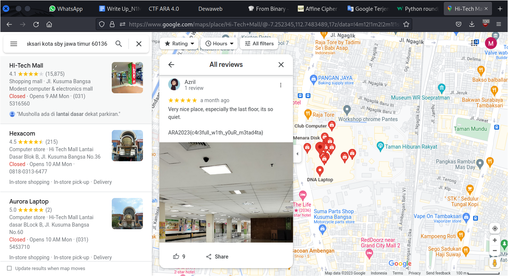

# Backroom

## Description

I found a place that give me a backroom vibes. I think I like this place, so I give this place 5 star. Can you find this place?

[Attachment](./Challenge/IMG20221221153220.jpg)

## Solution
We are given a picture for this challenge. If we use `exiftool` command, you'll found the GPS coordinate from this picture. This coordinate can be use to search the location on Google maps.

```
$ exiftool IMG20221221153220.jpg
-- output truncated --
Create Date                     : 2022:12:21 15:32:20.831
Date/Time Original              : 2022:12:21 15:32:20.831+07:00
Modify Date                     : 2022:12:21 15:32:20.831
GPS Date/Time                   : 2022:12:21 08:32:20Z
GPS Latitude                    : 7 deg 15' 9.97" S
GPS Longitude                   : 112 deg 45' 2.06" E
GPS Latitude Ref                : South
GPS Longitude Ref               : East
Circle Of Confusion             : 0.007 mm
Field Of View                   : 73.7 deg
Focal Length                    : 5.2 mm (35 mm equivalent: 24.0 mm)
GPS Position                    : 7 deg 15' 9.97" S, 112 deg 45' 2.06" E
Hyperfocal Distance             : 2.39 m
Light Value                     : 3.8
```

The search result using Google maps will give us the address of Hi-Tech Mall of the ground floor block B number 1. The complete address is Kusuma Bangsa street at Surabaya. When we looking for the reviews for this place on Google maps, we got the flag from the account name Azril and the photo that he sent in his review is similar with the picture for the assignment of this challenge.



## Flag
`ARA2023{c4r3full_w1th_y0uR_m3tad4ta}`
