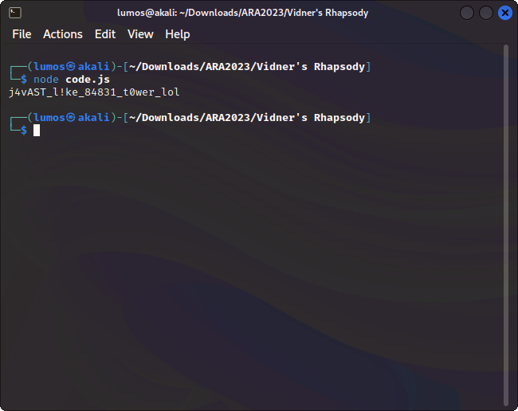

# Vidner's Rhapsody

## Description
Once I was going to send you the program, but do me a favor by retrieving the real output of the program from this generated JSON program tree. Can you?

[Attachments](./Challenge/mytscode.json)

## Solution
This time we got a JSON file that looks like a structure of a program. So the JSON file is an AST (Abstract Syntax Tree) which is a writing of the structure of the original program in tree form.


Honestly, I'm too lazy to write the code for this AST to become a program manually. So, I tried to search to make this AST become a code of a program that are faster and automatically. Finally, I found [escodegen](https://github.com/estools/escodegen/tree/master), with this we can convert or translate the AST into Javascript code automatically. You can check the Javascript program below to use escodegen.

```js
const fs = require('fs')
const escodegen = require('escodegen')

let file = fs.readFileSync('mytscode.json')
let parser = JSON.parse(file)
console.log(escodegen.generate(parser));
```

By executing the above program, we'll get this Javascript program.

```js
function mystenc(berserk, guts) {
    var s = [], j = 0, x, res = '';
    for (var i = 0; i < 256; i++) {
        s[i] = i;
    }
    for (i = 0; i < 256; i++) {
        j = (j + s[i] + berserk.charCodeAt(i % berserk.length)) % 256;
        x = s[i];
        s[i] = s[j];
        s[j] = x;
    }
    i = 0;
    j = 0;
    for (var y = 0; y < guts.length; y++) {
        i = (i + 1) % 256;
        j = (j + s[i]) % 256;
        x = s[i];
        s[i] = s[j];
        s[j] = x;
        res += String.fromCharCode(guts[y] ^ s[(s[i] + s[j]) % 256]);
    }
    console.log(res);
}
var berserk = 'achenk';
var strenk = [
    244,
    56,
    117,
    247,
    61,
    16,
    3,
    64,
    107,
    57,
    131,
    13,
    137,
    113,
    214,
    238,
    178,
    199,
    4,
    115,
    235,
    139,
    201,
    22,
    164,
    132,
    175
];
mystenc(berserk, strenk);
```

Now we just need to save the code of this Javascript program into .js file and run it.



## Flag
`ARA2023{j4vAST_l!ke_84831_t0wer_lol}`
