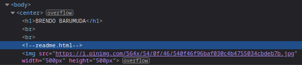
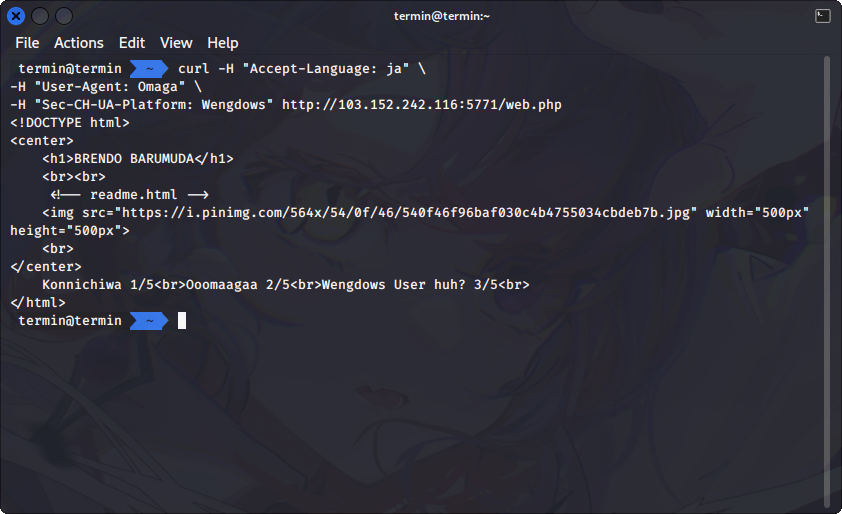
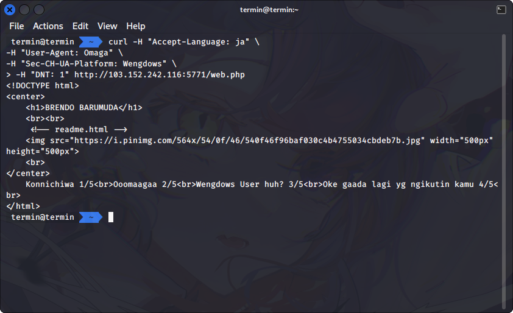
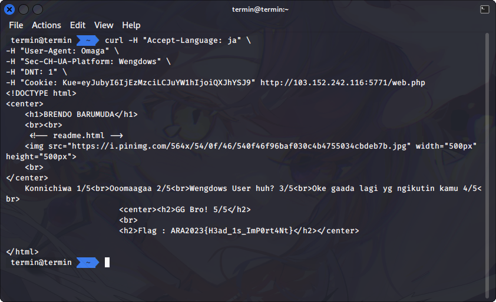

# X-is for blabla

## Description
Recently my friend was buy helmet called RFC 2616, pretty strange huh?

http://103.152.242.116:5771/web.php

## Hints
- [This maybe Help you](https://developer.mozilla.org/en-US/docs/Web/HTTP/Headers)
- Readme is important. Are you ever heard about a json cookie?

## Solution
When I opened and the web page and view its source code, there's an information that might be help to solve the challenge. There's a commented line in its HTML source that said about `readme.html`



The translated version of `readme.html` like below

> Brendo merupakan youtuber mukbang dari Jepang.
> Brendo setiap mengupload video youtube nya menggunakan browser yang hits yaitu Omaga.
> Tentunya di laptop/komputer Brendo menggunakan sistem operasi Wengdows agar bisa bekerja secara produktif.
> Ohh ya, akhir - akhir banyak kasus stalker kepada youtuber di Jepang, oleh karena itu Brendo tidak suka diikuti oleh stalker.
> Biasanya, setelah melakukan streaming Brendo selalu membeli Kue yang berada di dekat rumahnya.
Tempat toko kue tersebut ada di jalan No. 1337, selain kue dari toko tersebut enak ada alasan lain Brendo sering membeli kue di tempat tersebut.
Itu karena sang penjaga toko adalah perempuan cantik bernama Araa, oleh karena itu Brendo mencoba mendekati perempuan tersebut untuk menjadi pacarnya.

> English translation: <br>
> **Brendo is a mukbang youtuber from Japan. He use the hit browser Omaga each time he's uploading video to youtube. Of course, on his laptop/computer Brendo uses Wengdows operating system so he can work productively. Recently, there have been many cases of stalking of youtuber in Japan, that's why he doesn't like being followed by the stalkers. Usually, after finished streaming Brendo always buys a cake near his house. The cake shop is located on street number 1337, besides the cakes from the shop are delicious there is another reason Brendo often buys cakes there. That's because the shopkeeper is a beautiful woman named Araa, therefore Brendo tries to approach the woman to be his girlfriend.**

From the information of `readme.html` there's a few things that we need to set to get the flag:
1. Change the language to accessing the http://103.152.242.116:5771/web.php to Japanese.
2. Change the browser to Omaga
3. Change the operating system to Wengdows
4. Turn on "Do no Track"
5. Set a cookie with called "Kue"

For the first step, we need to set the header of `Accept-Language: ja` to change the language preferences of our browser to Japanese. This is the response after changing the `Accept-Language` header.


The next is to change the browser to Omaga. How we can change that? Because there's no browser named Omaga, we can set the `User-Agent` header to `User-Agent: Omaga` to tell the web page that we're using Omaga browser. After we set the `User-Agent: Omaga` we got another responses from the server.


The third step is to tell the web page that we're using Wengdows operating system, by change the header to `Sec-CH-UA-Platform: Wengdows`. This the response after we change the header.



In the fourth step we are told that Brendo does not like stalkers, so we need to set the `DNT: 1` header in the browser or we can open it in Incognito mode in chromium based browsers or Private mode in Firefox browsers. The fourth progress is as follows.



For the last step, we know that we need to set cookie called `Kue` from the information of `readme.html`. The street number 1337 and Araa also seems like a value of this cookie or maybe different cookie. After trying for a few times, it seems that the `Kue` cookie have 2 values, which are number 1337 and Araa. We tried to combine this value as a JSON cookie that have been encoded using base64. 

``` shell
echo -n '{"no":"1337","nama":"Araa"}' | base64
```

The result of this encoding is:

```
eyJubyI6IjEzMzciLCJuYW1hIjoiQXJhYSJ9
```

Now, let's insert this base64 encoded value into `Kue` cookie value. For this we need to set this header `Cookie: Kue=eyJubyI6IjEzMzciLCJuYW1hIjoiQXJhYSJ9`. This will bring the response to show the flag from the web server.



Not gonna lie this was how I felt when trying to find the correct value for the cookie part.


## Flag
`ARA2023{H3ad_1s_ImP0rt4Nt}`
