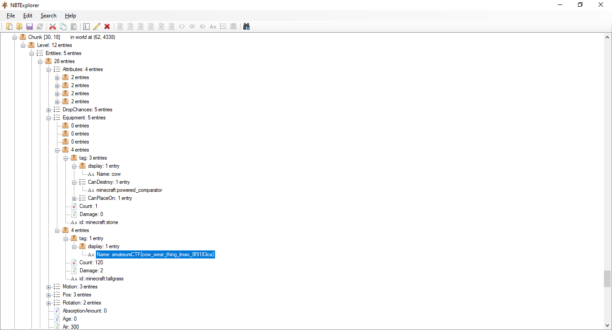

# Minceraft

## Deskripsi
I found these suspicious files on my minecraft server and I think there's a flag in them. I'm not sure where though.

Note: you do not need minecraft to solve this challenge. Maybe reference the minecraft region file format wiki?

## Attachments
[r.1.135.mca](./Challenge/r.1.135.mca)
[r.1.136.mca](./Challenge/r.1.136.mca)
[r.2.135.mca](./Challenge/r.2.135.mca)
[r.2.136.mca](./Challenge/r.2.136.mca)

## Solusi
Sedikit disclaimer, sejujurnya untuk challenge ini merupakan jenis challenge minecraft pertama yang pernah aku coba, jadi mohon maaf jika terdapat beberapa informasi yang kurang atau salah.
Pengetahuan mengenai game minecraft bisa menambah tingkat pemahaman untuk menyelesaikan challenge ini, namun tidak menutup kemungkinan untuk seseorang yang tidak mengerti sama sekali tentang minecraft masih bisa menyelesaikan challenge ini.

Untuk challenge ini diberikan 4 buah file .mca atau minecraft [anvil file format](https://minecraft.fandom.com/wiki/Anvil_file_format) yang merupakan pengembangan dari [region file format](https://minecraft.fandom.com/wiki/Region_file_format). File ini menyimpan [chunk](https://minecraft.fandom.com/wiki/Chunk_format) dari game minecraft seri Java Edition. Di dalamnya berupa struktur tag data untuk menyimpan data, yang sering disebut dengan NBT (Named Binary Tag). Informasi tambahan mengenai NBT bisa dibaca pada link [berikut](https://minecraft.fandom.com/wiki/NBT_format).

Untuk menyelesaikan challenge ini tidak perlu game minecraft, karena dari hasil penelusuran Google ditemukan aplikasi yang bisa kita gunakan untuk membuka file .mca, aplikasi tersebut bernama [NBTExplorer](https://www.minecraftforum.net/forums/mapping-and-modding-java-edition/minecraft-tools/1262665-nbtexplorer-nbt-editor-for-windows-and-mac).
Langkah pertama adalah membuka seluruh file .mca ke dalam NBTExplorer.
Hal yang menarik dari NBT adalah dari dalam game minecraft kita bisa mengubah atribut dari sebuah item di game dengan mengubah tag dan value-nya, seperti mengubah atribut senjata atau armor yang normalnya menggunakan anvil, tapi bisa menggunakan NBT. Contohnya ada pada video [berikut](https://www.youtube.com/watch?v=tb_G8lqNZQ4).
Langkah berikutnya adalah mencari adanya flag pada keempat file .mca. Karena disini aku tidak tahu pasti apakah flag yang ada mengikuti format, yaitu `amateursCTF{flag}`, maka pencarian dilakukan dengan melihat pada tag. Untuk mencari, klik menu Search > Find dan masukkan tag pada kolom Name.
Hasil pencarian menunjukkan flag ada pada file `r.1.135.mca` pada chunk `30, 18`.

## Flag
### amateursCTF{cow_wear_thing_lmao_0f9183ca}