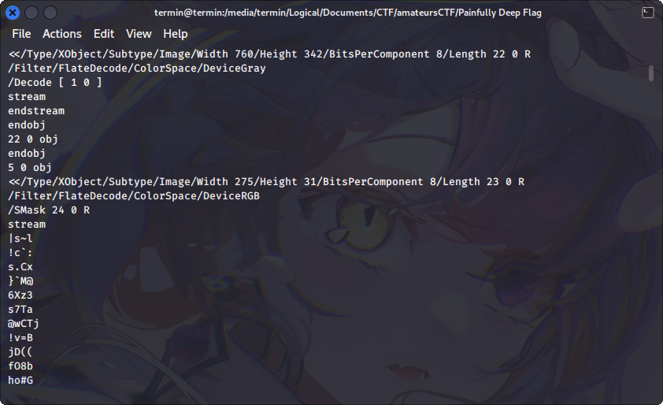

# Painfully Deep Flag

## Description
This one is a bit deep in the stack.

## Attachment
[flag.pdf](./Challenge/flag.pdf)

## Solution
In this challenge I need to analyze a PDF file. When analyzing PDF in forensic challenge, I usually will look at the structure of the PDF file, because sometimes I found additional information such as the possibility of embedded objects or images that are not visible to the naked eye. For this challenge I use this [reference](https://resources.infosecinstitute.com/topics/hacking/pdf-file-format-basic-structure/) about the structure of PDF.

The first step to analyzing the structure of `flag.pdf` using `strings` command.

```
strings flag.pdf
```

In this image below, the result of `strings` command shows us there are more than one images in this pdf, but we can only saw clearly one image.



To extract these images, we can use `pdfimages` command.

```
pdfimages flag.pdf extract/
```

The above command will extract all images in `flag.pdf` and the result will be saved on extract directory. The extracted images from that command is still in .ppm format, we need to convert these images to PNG or JPEG to open it using photo viewer apps.


## Flag
`amateursCTF{0ut_0f_b0unds}`
