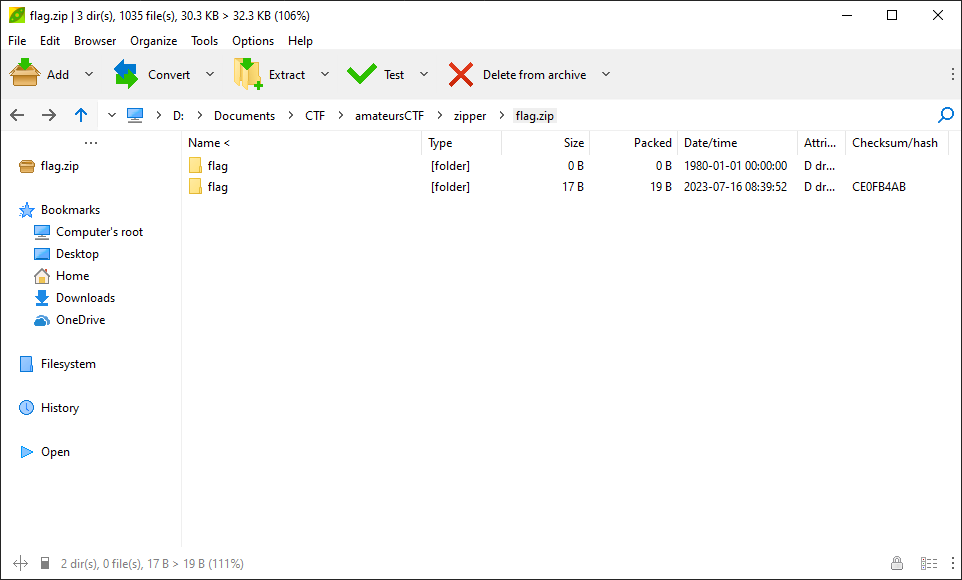
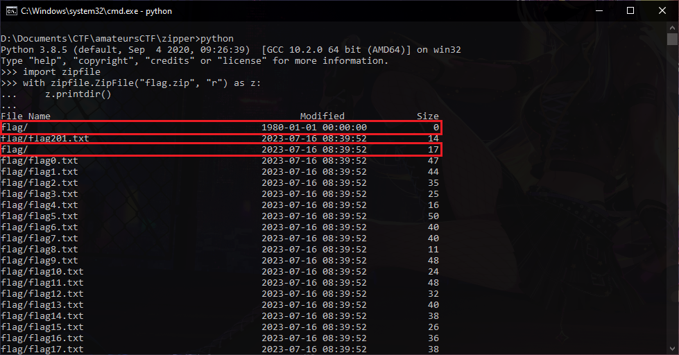
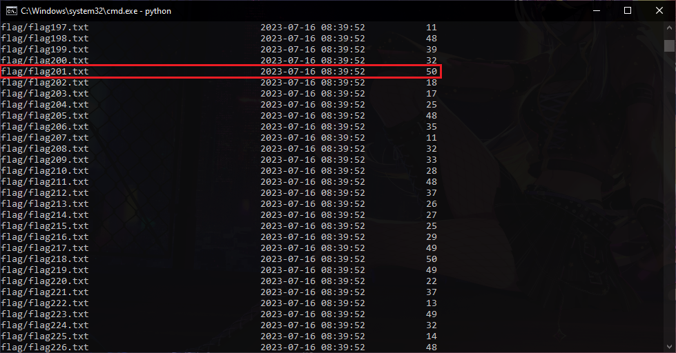

# zipper

## Description
Stare into the zip and the zip stares back.

## Attachment
[flag.zip](./Challenge/flag.zip)

## Solution
I got a zip archive for this challenge and if I opened it using [PeaZip](https://peazip.github.io/) there are 2 directory with same name, which is `flag` but the created/modified date is different.



Then I try to see the detail information and metadata from this zip file. By using PeaZip, right click on `flag` directory, select More > List > List all. You can find the first part of the flag on Comment section.


Scrolling down further, you'll find the third part of the flag on Comment section for the `flag` directory.


I already got 2 part of the flag that come from the metadata from the zip file.

```
Part 1: amateursCTF{z1PP3d_
Part 3: laY3r_0f
```

Next, to find the other part of the flag, we need to show all the the items in the zip file. When I opened the zip file using PeaZip earlier, you would notice that there are 2 directory with the same name called `flag`, but they have different created/modified date. I'm using Python interpreter to show all items from this zip file.

```python
>>> import zipfile
>>> with zipfile.ZipFile("flag.zip", "r") as z:
...     z.printdir()
...
```

After executing the Python code above on Python interpreter, the result is in this image below.





From the results, it shows that there are 2 files and 2 directories that have the same name as shown in PeaZip previously.
However, what is odd is that each size is different, which indicates that the contents are also different. The image shows that the `flag` directory that was modified or created on July 16, 2023 shows a size of 17 bytes, which probably contains another part of the flag.
Based on this information, the following Python program was created to read the part of flag that is likely in the `flag` directory.

```python
import zipfile

with zipfile.ZipFile('flag.zip', 'r') as z:
    names = z.namelist()
    for i in z.read(names[2]).split(b"\n"):
        print(i)
```

The different size and different modified date hits me in the eye and it not disappoint to try to run the code because I got the second part of the flag.

```
Part 1: amateursCTF{z1PP3d_
Part 2: in5id3_4_
Part 3: laY3r_0f
```

Then, for the files `flag201.txt` that have the same name also have different size, the first one is 14 bytes and the other is 50 bytes. For the file with 50 byte as its size, it's not the file with the part of the flag.

I try to modify the previous Python code to extract `flag201.txt` with the size is 14 bytes, but unfortunately it didn't work.
The next attempt is to extract the zip file using PeaZip, it is possible that the Python program cannot read or extract the 14 bytes `flag201.txt` file because Python incorrectly reads or extracts from the `flag` directory that was modified or created on July 16, 2023, because when opening the other `flag` directory it shows the size of the `flag201.txt` file is 14 bytes. 
We need to extract the `flag201.txt` from `flag` directory that was created or modified on January 1, 1980. After being extracted, it is true that there is the last flag section in the `flag201.txt` file with a size of 14 bytes.

```
Part 1: amateursCTF{z1PP3d_
Part 2: in5id3_4_
Part 3: laY3r_0f
Part 4: _Zips}
```

## Flag
`amateursCTF{z1PP3d_in5id3_4_laY3r_0f_Zips}`
