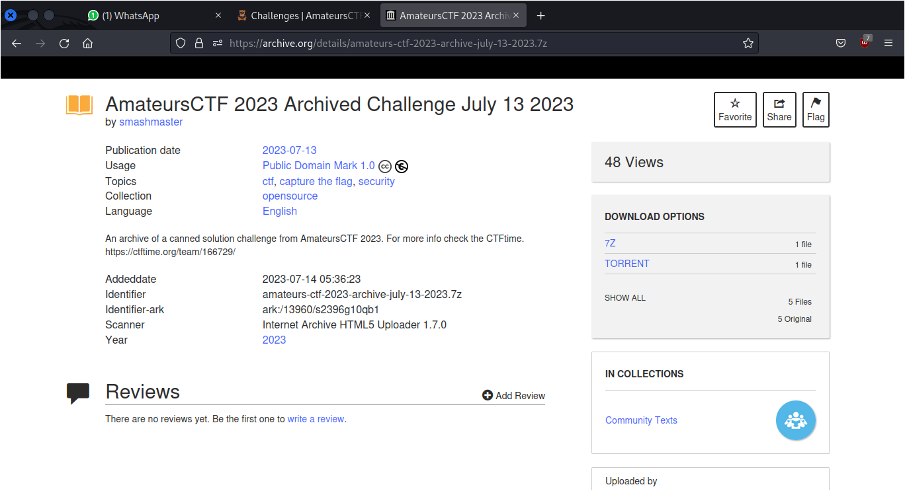

# Archived

## Description
This challenge has been archived.

## Solution
For this challenge, I try to search on Google with the keyword `amateursCTF archive`. From this result, there's an archive of the amateursCTF on [archive.org](https://archive.org/details/opensource?tab=collection&sort=-date&and%5B%5D=mediatype%3A%22%22texts%22+AND+%28Team%29%22).

On this website, I search using `amateursCTF` as the keyword. I found one result from this search.

If you open the search result, in there you'll find the download options of this archive. I choose 7z in this case.

After downloading the file, there are 3 files inside the 7z archive. These files are `challenge.yml`, `flag.txt`, and `solve.txt`. You can found the flag for this challenge on `challenge.yml` and `flag.txt`.

## Flag
`amateursCTF{arch1v3d_r1ght_b3f0r3_th3_start}`
