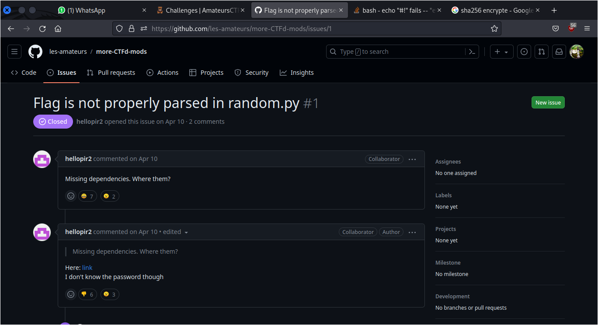
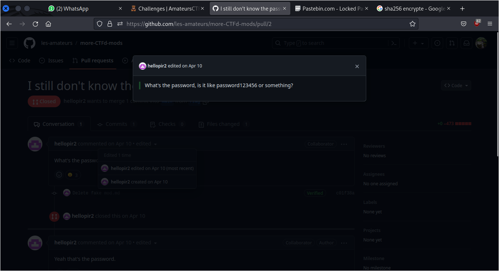

# Gitint 7d

## Description
One of the repos in the les-amateurs organization is kind of suspicious. Can you find all the real flags in that repository and report back? There are 3 flags total, one of which is worth 0 points. For this challenge, submit the flag with the sha256 hash 
```
7de880d63a3f2494b75286906dba179ee59cc738ea5e275094f94c5457396f48
```
NOTE:
You may get iplocked out of the pastebin if you guess the password too many times, so please don't guess. The password is obvious when you see it.

## Solution
After we found the flag of the previous challenge [Gitint 5e](https://github.com/n1mdacybersec/CTF-Write-Up-Collection/blob/main/2023/AmateursCTF/OSINT/Gitint%205e/README.md), now I need to find another flag on this [les-amateurs repository](https://github.com/les-amateurs/more-CTFd-mods) because from the description of this challenge there're other flag on this Github repository. 
This time I'll use Github search feature. The search used the following keywords.

```
repo:les-amateurs/more-CTFd-mods flag
```

From this search there's an interesting result. In the Issues section there's one entry that match my search earlier. From this issue I got a link for [pastebin](https://pastebin.com/VeTDwT09).



But, this pastebin is protected by a password. Maybe we can find some clues about the password to open this pastebin on `more-CTFd-mods` repository.
The search was carried out again using the search feature on Github, the following are the keyword used.

```
repo:les-amateurs/more-CTFd-mods password
```

In the search result, I found one entry from Issues and one entry from Pull requests. The one from the Issues section is the same with our previous search for keyword `flag`. Then, we just need to check the one from Pull requests. This pull requests are committed by `hellopir2` and there's a comment or conversation from this user. In this comment or conversation I can't find the password. But, if you look closely the first conversation or comment are edited. You can found the password for pastebin on the original comment.



After I entered the password on pastebin, I got the flag.


Now, let's check the flag using the SHA256 hash that are provided on the description of this challenge to check if the flag is true or not.

```
$ echo -n 'amateursCTF{programs have issues, as do weak passwords}' | sha256sum
7de880d63a3f2494b75286906dba179ee59cc738ea5e275094f94c5457396f48  -
```

## Flag
`amateursCTF{programs have issues, as do weak passwords}`
