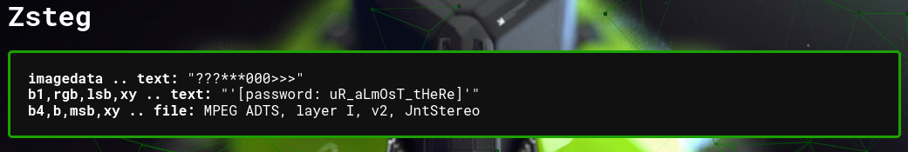
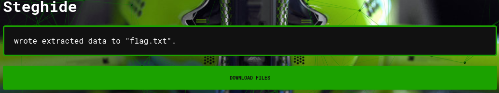

# Big JPG

## Description
There's more data to this image than what meets the eye.

-azroberts

## Attachment
[big-image.jpg](./Challenge/big-image.jpg)

## Solution
I got a jpg image for this challenge, and the description of the challenge said there's more data in this image.
For this challenge I will use https://www.aperisolve.com/ to extract any other informations from this image. The tool at Aperi'Solve combining all tool that we need for Steganography for image file.

Using this website there's xz compressed data.

After extracting the xz compressed data, there was a `605EA` file.
Check using `file` command and the result show that the file was tar compressed data, so we can extract it again.

After extracting file `605EA` we got 2 images, `key.png` and `flag.jpg`.
Let's check the `key.png` first using Aperi'Solve.

From `key.png` file, we know there's password from `zsteg` tool.
Probably this password was used for hide secret information using `zsteg` or `steghide` for `flag.jpg`.

Then, let's try to check the last image `flag.jpg` using Aperi'Solve. 
But before we submit the image as is, let's change a bit parameter first because we got a password in the previous step.
Before submitting the image, make sure you click enabled on `I've got a password !` and insert the password there. After you done with inserting the password, click submit.

From `steghide` tool we got a `flag.txt` file. It should be the flag for this challenge.

## Flag
`UDCTF{lay3r5_0n_lay3r5}`

