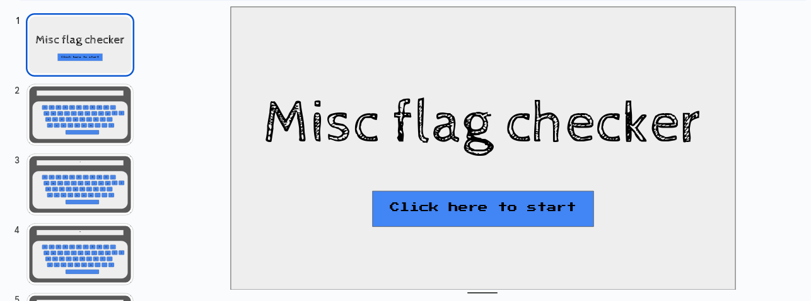
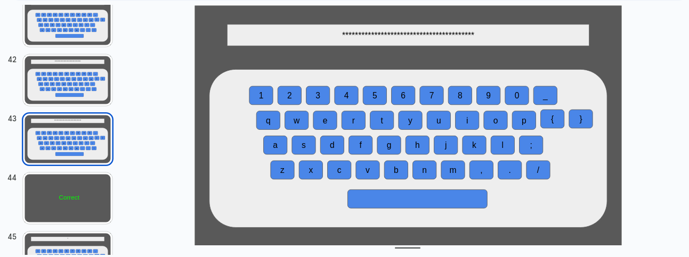

# Turing Complete

## Description
I made an app in google slide. https://docs.google.com/presentation/d/1cZR2r2pJJTWadv2Zw60KIMFxLfMRLNaL7jSPIlq_at0/view

-JD

https://docs.google.com/presentation/d/e/2PACX-1vR2Ysljc5XxbSQZPiZE7RMZ8AbYHojbO800cXm1q88VvFxeQfTc9G26uTqSUtnKQHotSYhDeTUGJBT9/pub

## Solution
This is how the challenge would look like

All the characters inside the input text would become characters `*`, similar when we type a password all the characters would become `*`. If we look at 43rd slide, there's all `*` characters and the next slide there was Correct written on it.

How can we get the flag before it would become `*`?
From the description of the challenge, we know that the author made an app using Google Slide.
We can make an app using any Google Documents suit because there is a feature to make a program using Javascript.

To know the program in this presentation, we can make a copy of this presentation.
After make a copy of this presentation, choose menu Extension > Apps Script.
In the `Code.gs` we can see the flag for this challenge.

## Flag
`udctf{p0w3rp0int_app_4s_n0_c0de_p1atf0rm5}`