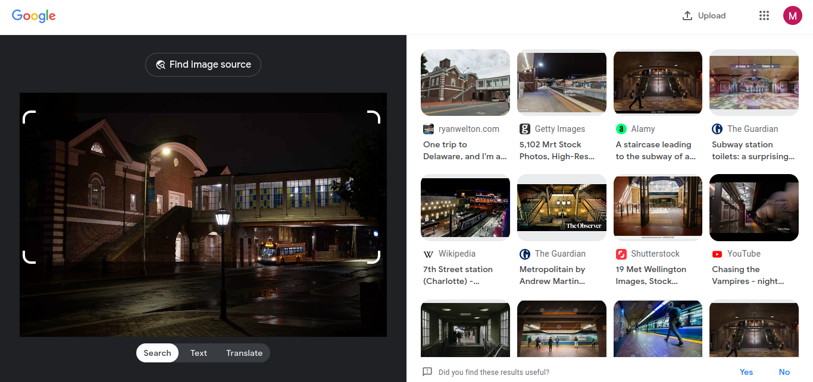
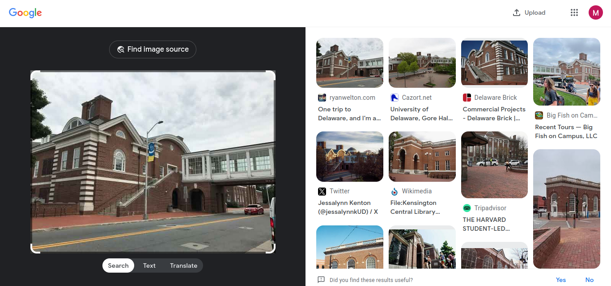

# Spooky Street

## Description
What is the name of this building?

Flag format UDCTF{building-name}

-azrobert

## Attachment
[image.jpg](./Challenge/image.jpg)

## Solution
In this challenge we need to find the name of the building in this image.
To do that we can use reverse image search, in this case I was using [Google](https://images.google.com/).
From the search result, I found one image that match with this image.

This is the [link](https://ryanwelton.com/2017/06/10/university-of-delaware/) for that result, but unfortunatelay I can't found the building name.
Then I downloaded the image on that site and I try to reverse image search again.
Using the new image I got more result with the exact same location, I guess taking a picture in daylight will make the possibility to find the exact same location higher because most peoples capture the photo in daylight.

Then I continued my journey to found the name of the building in the picture in this [link](https://cazort.net/photos/udel-gore-hall-from-kirkbride). 
On that site the picture was taken from the second floor of Kirkbride Lecture Hall, which is nearby that building.
Then I search on Google Maps `Kirkbride Lecture Hall` and using street view to navigate near that building.
After searching around, I found that the name of that building is Gore Hall.

## Flag
`UDCTF{gore-hall}`