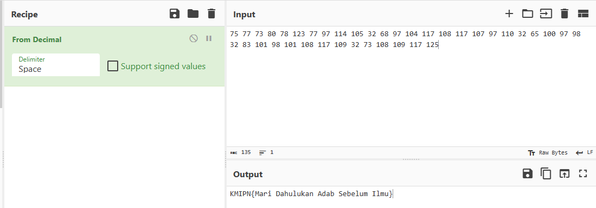

# Waktunya Peng_dekriptor_an

## Deskripsi
diberikan file flag.txt berisi kode morse berikut:

```
--... ..... / --... --... / --... ...-- / ---.. ----- / --... ---.. / .---- ..--- ...-- / --... --... / ----. --... / .----
.---- ....- / .---- ----- ..... / ...-- ..--- / -.... ---.. / ----. --... / .---- ----- ....- / .---- .---- --... / .----
----- ---.. / .---- .---- --... / .---- ----- --... / ----. --... / .---- .---- ----- / ...-- ..--- / -.... ..... / .----
----- ----- / ----. --... / ----. ---.. / ...-- ..--- / ---.. ...-- / .---- ----- .---- / ----. ---.. / .---- ----- .---- /
.---- ----- ---.. / .---- .---- --... / .---- ----- ----. / ...-- ..--- / --... ...-- / .---- ----- ---.. / .---- -----
----. / .---- .---- --... / .---- ..--- .....
```

## Solusi
Dilakukan dekripsi kode morse menggunakan [Morse Code Translator | Morse Code World](https://morsecode.world/international/translator.html) didapatkan list integer berikut:


Selanjutnya integer tersebut yang merupakan bilangan desimal dikonversi ke ASCII untuk mendapatkan flag. Digunakan [CyberChef](https://gchq.github.io/CyberChef/) untuk melakukan konversi tersebut.



## Flag
### KMIPN{Mari Dahulukan Adab Sebelum Ilmu}