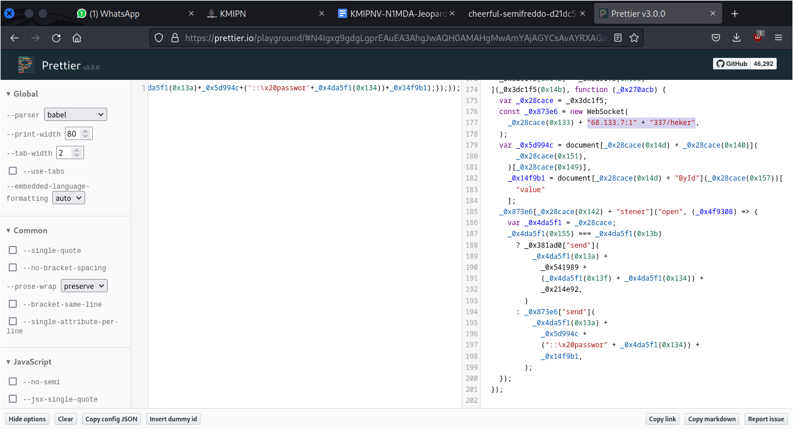

# Code

## Deskripsi
Hacker sepertinya menyerang personal, selama ini dia meniru laman login untuk
menipu user. 
Mereka menggunakan phising untuk merekam aktivitas dari user yang ingin login
agar mendapatkan sebuah creds. 
Apakah anda dapat mencari ip dan port server yang hacker untuk mengumpulkan
data? 
`FORMAT FLAG: KMIPN{ip:port}`

## Attachment
[code.zip](./Challenge/code.zip)

## Solusi
File zip yang diberikan berisi file HTML dan CSS. Penelusuran dilakukan pada kedua
file tersebut, namun hal yang menarik ada pada file HTML tersebut.

Pada line 26, terlihat bahwa terdapat file JS yang tidak termasuk ke dalam file zip
yang diberikan. Pengecekan selanjutnya dilakukan pada file JS tersebut.
Tampilan dari file JS tersebut kurang begitu mudah untuk dibaca, oleh karena itu
digunakan [Prettier](https://prettier.io/playground/) untuk merapikan file JS tersebut dan membuatnya lebih mudah
dibaca.

Dari hasil tersebut meskipun code JS sudah di obfuscate tetapi masih terdapat IP
address dan port yang dipecah dalam code JS tersebut.

Terdapat potongan IP address dan port yang digunakan oleh `heker` dan jika
digabungkan adalah 192.168.133.7:1337

## Flag
### KMIPN{192.168.133.7:1337}