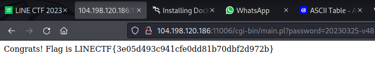

# Old Pal

## Description
How about an Old Pal for your aperitif?
http://104.198.120.186:11006/cgi-bin/main.pl?password= 

## Attachment
[old-pal_83f83ad1987703c23f4ca32725a30385.tar.gz](https://github.com/n1mdacybersec/CTF-Write-Up-Collection/blob/main/2023/LINE-CTF/Web/Old%20Pal/Challenge/old-pal_83f83ad1987703c23f4ca32725a30385.tar.gz)

## Solution
To obtain the flag in this challenge, we need to insert the right password. But, first let's take a look at the source code of the program that are built using Perl.

```perl
#!/usr/bin/perl
use strict;
use warnings;

use CGI;
use URI::Escape;


$SIG{__WARN__} = \&warn;
sub warn {
    print("Hacker? :(");
    exit(1);
}


my $q = CGI->new;
print "Content-Type: text/html\n\n";


my $pw = uri_unescape(scalar $q->param("password"));
if ($pw eq '') {
    print "Hello :)";
    exit();
}
if (length($pw) >= 20) {
    print "Too long :(";
    die();
}
if ($pw =~ /[^0-9a-zA-Z_-]/) {
    print "Illegal character :(";
    die();
}
if ($pw !~ /[0-9]/ || $pw !~ /[a-zA-Z]/ || $pw !~ /[_-]/) {
    print "Weak password :(";
    die();
}
if ($pw =~ /[0-9_-][boxe]/i) {
    print "Do not punch me :(";
    die();
}
if ($pw =~ /AUTOLOAD|BEGIN|CHECK|DESTROY|END|INIT|UNITCHECK|abs|accept|alarm|atan2|bind|binmode|bless|break|caller|chdir|chmod|chomp|chop|chown|chr|chroot|close|closedir|connect|cos|crypt|dbmclose|dbmopen|defined|delete|die|dump|each|endgrent|endhostent|endnetent|endprotoent|endpwent|endservent|eof|eval|exec|exists|exit|fcntl|fileno|flock|fork|format|formline|getc|getgrent|getgrgid|getgrnam|gethostbyaddr|gethostbyname|gethostent|getlogin|getnetbyaddr|getnetbyname|getnetent|getpeername|getpgrp|getppid|getpriority|getprotobyname|getprotobynumber|getprotoent|getpwent|getpwnam|getpwuid|getservbyname|getservbyport|getservent|getsockname|getsockopt|glob|gmtime|goto|grep|hex|index|int|ioctl|join|keys|kill|last|lc|lcfirst|length|link|listen|local|localtime|log|lstat|map|mkdir|msgctl|msgget|msgrcv|msgsnd|my|next|not|oct|open|opendir|ord|our|pack|pipe|pop|pos|print|printf|prototype|push|quotemeta|rand|read|readdir|readline|readlink|readpipe|recv|redo|ref|rename|require|reset|return|reverse|rewinddir|rindex|rmdir|say|scalar|seek|seekdir|select|semctl|semget|semop|send|setgrent|sethostent|setnetent|setpgrp|setpriority|setprotoent|setpwent|setservent|setsockopt|shift|shmctl|shmget|shmread|shmwrite|shutdown|sin|sleep|socket|socketpair|sort|splice|split|sprintf|sqrt|srand|stat|state|study|substr|symlink|syscall|sysopen|sysread|sysseek|system|syswrite|tell|telldir|tie|tied|time|times|truncate|uc|ucfirst|umask|undef|unlink|unpack|unshift|untie|use|utime|values|vec|wait|waitpid|wantarray|warn|write/) {
    print "I know eval injection :(";
    die();
}
if ($pw =~ /[Mx. squ1ffy]/i) {
    print "You may have had one too many Old Pal :(";
    die();
}


if (eval("$pw == 20230325")) {
    print "Congrats! Flag is LINECTF{redacted}"
} else {
    print "wrong password :(";
    die();
};
```

From this program, we cannot do an evaluation injection or something similar because there's a blacklist that restrict us to exploit this method.
If we look at the source code, there's a hardcoded value of the password, which is `20230325`. But, we cannot insert only a numeric value as a password, because there's a logic to check that our inserted password are valid. This is the logic to check the validity of the password:
- Password cannot be empty
- Password must no exceeded 20 characters
- Password must contains alphanumeric values, it's include numbers `0-9`, alphabets `a-z` or `A-Z` and also contains a special character `_` or `-`.

So, how do we exploit this web application and make our inserted password valid? To answer this, there's an interesting strings format on Perl called v-strings. By using this v-strings we can satisfy the checking condition of password validity but the value of the inserted password is still the same value as `20230325`. V-strings is a decimal value of ASCII that can be read by Perl as an ASCII characters. You can find more information about v-strings on Perl in this [reference](https://www.tutorialspoint.com/v-strings-in-perl)

The password to be used is the value 20230325 minus the v-string of the number 0. By following this logic, the value of the password is still same as `20230325`, because the checking condition of the inserted passowrd are in integer type. The password to solve this challenge and got the flag is in this picture below.



This is the explanation of the password to solve this challenge. The v-strings value of `v48` is equal to 0, you can check it manually at the ASCII table. If we inserted a value of `20230325-v48` as a password, the end result is stil equal to `20230325` because because any integer number minus 0 has the same value. This Perl code will add a clearer explanation.

``` perl
$pw = 20230325;
$zeroChar = v48; # represent 0 in ASCII
$pw2 = $pw-$zeroChar;

print "The value of pw = $pw\n";
print "The value of pw2 = $pw2\n";

if(eval("$pw == $pw2")){
    print "True";
}

# Output
# The value of pw = 20230325
# The value of pw2 = 20230325
# True
```

## Flag
`LINECTF{3e05d493c941cfe0dd81b70dbf2d972b}`
