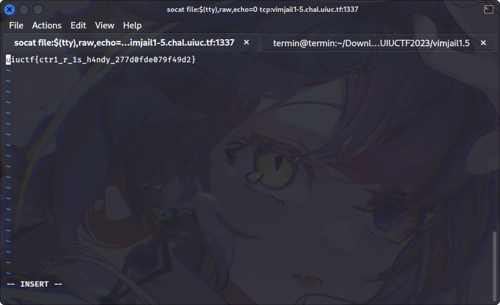

# vimjail1.5

## Deskripsi

Fixed unintended solve in vimjail1

Connect with `socat file:$(tty),raw,echo=0 tcp:vimjail1-5.chal.uiuc.tf:1337`. You may need to install socat.

## Attachment
[Dockerfile](./Challenge/Dockerfile)
[entry.sh](./Challenge/entry.sh)
[nsjail.cfg](./Challenge/nsjail.cfg)
[vimrc](./Challenge/vimrc)

## Solusi
Soal pengembangan dari vimjail1. Langsung saja kita lihat isi dari shell script `entry.sh`

```sh
#!/usr/bin/env sh

vim -R -M -Z -u /home/user/vimrc
```

Shell script yang digunakan hampir mirip dengan challenge vimjail1, hanya saja tidak terdapat command `chmod -r /flag.txt`. Disini dapat dilihat bahwa vim akan dijalankan menggunakan read-only mode, not modifiable mode, restricted mode, dan juga menggunakan konfigurasi tambahan dari `/home/user/vimrc`.

Selanjutnya mari kita lihat isi dari `vimrc`

```
set nocompatible
set insertmode

inoremap <c-o> nope
inoremap <c-l> nope
inoremap <c-z> nope
inoremap <c-\> nope
```

Terdapat sedikit perubahan pada `vimrc`, yaitu mapping key `Ctrl-\` di dalam insert mode akan digantikan dengan nope. 
Untuk menyelesaikan challenge ini caranya masih sama dengan vimjail1, yaitu:
- Masukkan register pada insert mode dengan menekan `Ctrl-r`
- Jalankan builtin function melalui register `=execute(":view flag.txt")`
- Akan muncul error bahwa modifiable dalam keadaan off, namun tekan enter untuk melihat isi flag.txt



## Flag
### uiuctf{ctr1_r_1s_h4ndy_277d0fde079f49d2}
