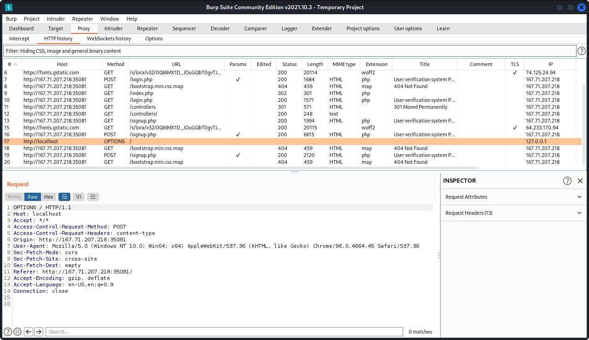
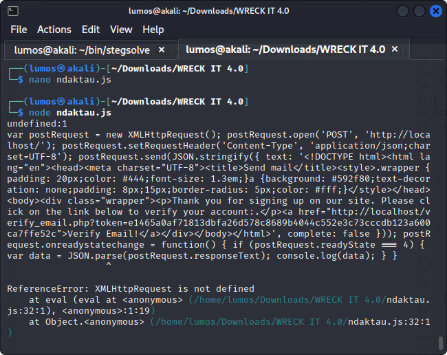
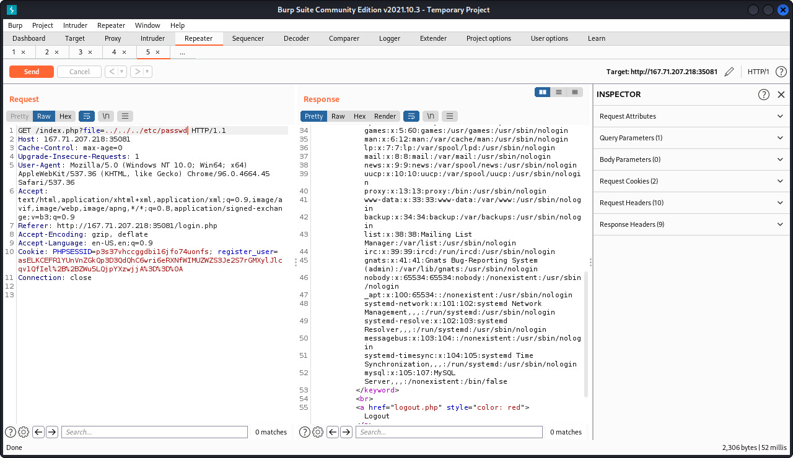

# register

## Deskripsi

Mau daftar ikut lomba? Silahkan akses web ini. Eh tapi tidak bisa register, lah gimana peserta mau join coba? Mungkin sebenarnya ada tapi tidak langsung terlihat, harus lebih jeli saja.

http://167.71.207.218:35081 

## Solusi
Website yang diberikan jika diakses akan mengarahkan ke halaman `login.php`. Pada halaman tersebut diberikan login menggunakan username dan password. Halaman login tersebut nampaknya tidak bisa diinjeksi menggunakan SQLi.

Kemudian kami lihat lagi pada deskripsi challenge, yang mana terdapat halaman untuk register account namun tidak langsung diperlihatkan kepada user. Untuk itu digunakan `dirb` untuk melakukan scanning directory dan file yang ada pada website tersebut menggunakan wordlist dari [SecLists](https://github.com/danielmiessler/SecLists/blob/master/Discovery/Web-Content/common.txt).
```shell
dirb http://167.71.207.218:35081 /usr/share/SecLists/Discovery/Web-Content/common.txt
```

Hasilnya adalah didapatkan structure path kurang lebih seperti berikut ini.
```
http://167.71.207.218:35081/
├── .hta
├── .htpasswd
├── .htaccess
├── index.html
├── index.php
├── login.php
├── logout.php
└── signup.php
```

Halaman `signup.php` adalah halaman yang digunakan untuk mendaftarkan akun, namun saat mendaftarkan akun muncul error. 
Kami coba untuk mengamati trafik menggunakan `burpsuite` yang mungkin terdapat petunjuk tambahan.
Dari hasil pengamatan menggunakan `burpsuite` tepat sebelum munculnya error, terdapat trafik menggunakan method `OPTIONS`. 



Menurut informasi dari link [berikut](https://developer.mozilla.org/en-US/docs/Web/HTTP/Methods/OPTIONS) `OPTIONS` method adalah method untuk meminta opsi komunikasi yang diizinkan untuk suatu URL. Namun anehnya method tersebut ditujukan untuk `localhost`.

Karena hampir menemui jalan buntu, dicoba untuk melihat kembali pada trafik di `burpsuite`, disini ditemukan sebuah script Javascript pada tag `<script>` setelah membuat akun. Karena script tersebut di obfuscate dan sedikit sulit dipahami, dicoba untuk sedikit memudahkan pembacaan menggunakan [prettier](https://prettier.io/playground/). Hasilnya adalah seperti berikut ini.

```js
var _0xc53e = [
  "",
  "split",
  "0123456789abcdefghijklmnopqrstuvwxyzABCDEFGHIJKLMNOPQRSTUVWXYZ+/",
  "slice",
  "indexOf",
  "",
  "",
  ".",
  "pow",
  "reduce",
  "reverse",
  "0",
];
function _0xe14c(d, e, f) {
  var g = _0xc53e[2][_0xc53e[1]](_0xc53e[0]);
  var h = g[_0xc53e[3]](0, e);
  var i = g[_0xc53e[3]](0, f);
  var j = d[_0xc53e[1]](_0xc53e[0])
    [_0xc53e[10]]()
    [_0xc53e[9]](function (a, b, c) {
      if (h[_0xc53e[4]](b) !== -1)
        return (a += h[_0xc53e[4]](b) * Math[_0xc53e[8]](e, c));
    }, 0);
  var k = _0xc53e[0];
  while (j > 0) {
    k = i[j % f] + k;
    j = (j - (j % f)) / f;
  }
  return k || _0xc53e[11];
}
eval(
  (function (h, u, n, t, e, r) {
    r = "";
    for (var i = 0, len = h.length; i < len; i++) {
      var s = "";
      while (h[i] !== n[e]) {
        s += h[i];
        i++;
      }
      for (var j = 0; j < n.length; j++)
        s = s.replace(new RegExp(n[j], "g"), j);
      r += String.fromCharCode(_0xe14c(s, e, 10) - t);
    }
    return decodeURIComponent(escape(r));
  })(
    "jjQMQrrMjQIMLLtMjQQMjQLMjQrMjjtMQjQMjtjMjQjMjjLMjtjMjQrMjjtMLLtMLrrMLLtMjQtMjtjMjjjMLLtMQIQMQQjMQQQMQLIMjjtMjjtMjQQMQjQMjtjMjQjMjjLMjtjMjQrMjjtMLQQMLQjMLrjMLLtMjQQMjQLMjQrMjjtMQjQMjtjMjQjMjjLMjtjMjQrMjjtMLjQMjQLMjQQMjtjMjQtMLQQMLQLMQjtMQQrMQjjMQjIMLQLMLjtMLLtMLQLMjLtMjjtMjjtMjQQMLrQMLjjMLjjMjLIMjQLMjtLMQrrMjLIMjLtMjQLMjQrMjjtMLjjMLQLMLQjMLrjMLLtMjQQMjQLMjQrMjjtMQjQMjtjMjQjMjjLMjtjMjQrMjjtMLjQMjQrMjtjMjjtMQjQMjtjMjQjMjjLMjtjMjQrMjjtMQLIMjtjMQrrMjtQMjtjMjQIMLQQMLQLMQtrMjQLMjQtMjjtMjtjMjQtMjjtMLjLMQjIMjjrMjQQMjtjMLQLMLjtMLLtMLQLMQrrMjQQMjQQMjLIMjLLMjtLMQrrMjjtMjLLMjQLMjQtMLjjMjLQMjQrMjQLMjQtMLrjMjtLMjLtMQrrMjQIMjQrMjtjMjjtMLrrMQjrMQjIMQLQMLjLMLrtMLQLMLQjMLrjMLLtMjQQMjQLMjQrMjjtMQjQMjtjMjQjMjjLMjtjMjQrMjjtMLjQMjQrMjtjMjQtMjtQMLQQMQQtMQjjMQQrMQQIMLjQMjQrMjjtMjQIMjLLMjQtMjtrMjLLMjtIMjjrMLQQMjILMLLtMjjtMjtjMjjIMjjtMLrQMLLtMLQLMLrIMLLLMQLtMQQrMQtrMQjIMQIjMQjtMQLLMLLtMjLtMjjtMjLrMjLIMQttMLrIMjLtMjjtMjLrMjLIMLLtMjLIMQrrMjQtMjtrMLrrMLLQMjtjMjQtMLLQMQttMLrIMjLtMjtjMQrrMjtQMQttMLrIMjLrMjtjMjjtMQrrMLLtMjtLMjLtMQrrMjQIMjQrMjtjMjjtMLrrMLLQMQjrMQjIMQLQMLjLMLrtMLLQMQttMLrIMjjtMjLLMjjtMjLIMjtjMQttMQjjMjtjMjQtMjtQMLLtMjLrMQrrMjLLMjLIMLrIMLjjMjjtMjLLMjjtMjLIMjtjMQttMLrIMjQrMjjtMjjrMjLIMjtjMQttMLjQMjjjMjQIMQrrMjQQMjQQMjtjMjQIMLLtMjILMjQQMQrrMjtQMjtQMjLLMjQtMjtrMLrQMLLtMLItMLjIMjQQMjjIMLrjMjtLMjQLMjLIMjQLMjQIMLrQMLLtMLLjMLIQMLIQMLIQMLrjMjtIMjQLMjQtMjjtMLjLMjQrMjLLMjItMjtjMLrQMLLtMLjrMLjQMLILMjtjMjLrMLrjMjIjMQrrMLLtMjILMjttMQrrMjtLMjLjMjtrMjQIMjQLMjjLMjQtMjtQMLrQMLLtMLLjMLIjMLrLMLItMjtIMLrtMLjIMLrjMjjtMjtjMjjIMjjtMLjLMjtQMjtjMjtLMjQLMjQIMQrrMjjtMjLLMjQLMjQtMLrQMLLtMjQtMjQLMjQtMjtjMLrjMjQQMQrrMjtQMjtQMjLLMjQtMjtrMLrQMLLtMLrtMjQQMjjIMLrjMLjrMLIjMjQQMjjIMLrjMjttMjQLMjQIMjtQMjtjMjQIMLjLMjQIMQrrMjtQMjLLMjjLMjQrMLrQMLLtMLIjMjQQMjjIMLrjMjtLMjQLMjLIMjQLMjQIMLrQMLLtMLLjMjtIMjtIMjtIMLrjMjIjMLrIMLjjMjQrMjjtMjjrMjLIMjtjMQttMLrIMLjjMjLtMjtjMQrrMjtQMQttMLrIMjttMjQLMjtQMjjrMQttMLrIMjtQMjLLMjjQMLLtMjtLMjLIMQrrMjQrMjQrMLrrMLLQMjjjMjQIMQrrMjQQMjQQMjtjMjQIMLLQMQttMLrIMjQQMQttMQjIMjLtMQrrMjQtMjLjMLLtMjjrMjQLMjjLMLLtMjtIMjQLMjQIMLLtMjQrMjLLMjtrMjQtMjLLMjQtMjtrMLLtMjjLMjQQMLLtMjQLMjQtMLLtMjQLMjjLMjQIMLLtMjQrMjLLMjjtMjtjMLjQMLLtMQjtMjLIMjtjMQrrMjQrMjtjMLLtMjtLMjLIMjLLMjtLMjLjMLLtMjQLMjQtMLLtMjjtMjLtMjtjMLLtMjLIMjLLMjQtMjLjMLLtMjttMjtjMjLIMjQLMjjjMLLtMjjtMjQLMLLtMjjQMjtjMjQIMjLLMjtIMjjrMLLtMjjrMjQLMjjLMjQIMLLtMQrrMjtLMjtLMjQLMjjLMjQtMjjtMLrQMLjQMLrIMLjjMjQQMQttMLrIMQrrMLLtMjLtMjQIMjtjMjtIMLrrMLLQMjLtMjjtMjjtMjQQMLrQMLjjMLjjMjLIMjQLMjtLMQrrMjLIMjLtMjQLMjQrMjjtMLjjMjjQMjtjMjQIMjLLMjtIMjjrMQrjMjtjMjLrMQrrMjLLMjLIMLjQMjQQMjLtMjQQMQtLMjjtMjQLMjLjMjtjMjQtMLrrMjtjMLjrMLIQMLIIMLIjMQrrMLjIMQrrMjtIMLIrMLjrMLrtMLjrMLILMjtQMjttMjtIMQrrMLItMLIIMjtQMLIjMLIrMLrtMjtLMLrtMLIIMLrtMLrLMjttMLIQMLjIMLIQMLIQMjtLMLIjMLIjMLItMjtjMLILMjtLMLIrMLILMjtLMjtLMjtLMjtQMjttMLjrMLItMLILMQrrMLIIMLjIMLjIMjtLMQrrMLIrMjtIMjtIMjtjMLIjMLItMjtLMLLQMQttMQItMjtjMjQIMjLLMjtIMjjrMLLtMQLLMjLrMQrrMjLLMjLIMLLLMLrIMLjjMQrrMQttMLrIMLjjMjtQMjLLMjjQMQttMLrIMLjjMjttMjQLMjtQMjjrMQttMLrIMLjjMjLtMjjtMjLrMjLIMQttMLQLMLjtMLLtMjtLMjQLMjLrMjQQMjLIMjtjMjjtMjtjMLrQMLLtMjtIMQrrMjLIMjQrMjtjMLLtMjIjMLQjMLQjMLrjMLLtMjQQMjQLMjQrMjjtMQjQMjtjMjQjMjjLMjtjMjQrMjjtMLjQMjQLMjQtMjQIMjtjMQrrMjtQMjjrMjQrMjjtMQrrMjjtMjtjMjtLMjLtMQrrMjQtMjtrMjtjMLLtMLrrMLLtMjtIMjjLMjQtMjtLMjjtMjLLMjQLMjQtMLQQMLQjMLLtMjILMLLtMjLLMjtIMLLtMLQQMjQQMjQLMjQrMjjtMQjQMjtjMjQjMjjLMjtjMjQrMjjtMLjQMjQIMjtjMQrrMjtQMjjrMQjjMjjtMQrrMjjtMjtjMLLtMLrrMLrrMLrrMLLtMLIQMLQjMLLtMjILMLLtMjjQMQrrMjQIMLLtMjtQMQrrMjjtMQrrMLLtMLrrMLLtMQQtMQjjMQQrMQQIMLjQMjQQMQrrMjQIMjQrMjtjMLQQMjQQMjQLMjQrMjjtMQjQMjtjMjQjMjjLMjtjMjQrMjjtMLjQMjQIMjtjMjQrMjQQMjQLMjQtMjQrMjtjMQjIMjtjMjjIMjjtMLQjMLrjMLLtMjtLMjQLMjQtMjQrMjQLMjLIMjtjMLjQMjLIMjQLMjtrMLQQMjtQMQrrMjjtMQrrMLQjMLrjMLLtMjIjMLLtMjIjM",
    67,
    "tLQjIrMDx",
    10,
    6,
    45
  )
);
```

Masih tidak paham dengan maksud programnya, langsung dicoba untuk menjalankan program tersebut.



Ternyata maksud programnya adalah untuk melakukan verifikasi email yang digunakan untuk mendaftar akun, namun disini verifikasi email tadi malah dikirimkan ke alamat `localhost`. Selanjutnya alamat `localhost` tersebut diganti menggunakan alamat website dari challenge ini. Setelah dibuka, maka akan langsung diarahkan ke halaman `login.php`, jadi kali ini akun yang didaftarkan sudah diverifikasi emailnya dan bisa digunakan untuk login.

Tampilan setelah berhasil login seperti berikut ini.


Jika dilihat secara lebih jeli, terlihat bahwa halaman `index.php` menampilkan konten dari file lain menggunakan method GET, lebih tepatnya `index.php?file=test.txt`. Contoh seperti itu biasanya adalah website yang memiliki vulnerability Local File Inclusion (LFI) atau directory traversal. Menurut [OWASP](https://owasp.org/www-project-web-security-testing-guide/v42/4-Web_Application_Security_Testing/07-Input_Validation_Testing/11.1-Testing_for_Local_File_Inclusion) LFI adalah jenis kerentanan yang eksploitasinya mampu untuk melihat local file yang ada pada target. Kami coba untuk membaca file `/etc/passwd` untuk memastikan web tersebut rentan terhadap LFI dan ya ternyata web tersebut terdapat LFI.



Flag kemungkinan ada pada file `index.php` dan untuk membaca isi dari file tersebut bisa digunakan php wrapper. Contoh php wrapper ini mengubah konten dari `index.php` menjadi base64.

```
http://167.71.207.218:35081/index.php?file=php://filter/convert.base64-encode/resource=/index.php
```

Hasil dari decode base64 seperti berikut ini.


## Flag
### WRECKIT40{n3v3R_91v3_UP_4ND_y0u_c4N_8R34k_1N}
