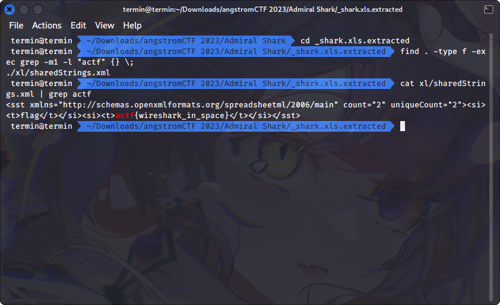

# Admiral Shark

## Deskripsi
I have been snooping on the [conversations](./Challenge/admiral_shark.pcapng) of my elusive enemies. See if you can help me gather the information I need to defeat them once and for all.

## Points
20

## Solusi
Saat melakukan follow TCP stream pada hasil capture packet Wireshark menunjukkan sebuah file yang dikirimkan melalui jaringan, yang sepertinya merupakan file xlsx atau file spreadsheet Excel.


Untuk menyimpan data tersebut, pilih Show data as Raw kemudian klik Save as


Setelah raw data tersebut disimpan, harus dicheck terlebih dahulu jenis filenya agar ketika menyimpan sebagai file aslinya bisa dibuka. 
Ciri-ciri dari hex data memang seperti dari file xlsx namun untuk signature filenya seperti telah rusak.
Berdasarkan [Wikipedia](https://en.wikipedia.org/wiki/List_of_file_signatures) file signature dari file xlsx sama dengan file zip, yaitu `50 4B 03 04`. Untuk itu perlu diubah byte ke 0-3 pada hex data menjadi `504B 0304`.

Untuk mengembalikan dari sebuah raw data ke file xlsx, digunakan program Python di bawah ini.

```python
import binascii

content = ""
data = "exported.txt"

with open(data, 'rb') as f:
    content += f.read().hex()

# return the binary data
content = binascii.a2b_hex(content)

with open("shark.xlsx",'wb') as f:
    f.write(content)
```

Setelah menjalankan program tersebut, file xlsx masih tidak bisa dibuka. Dicoba cara lain untuk melihat isi dari file xlsx tersebut. Seperti yang kita tahu bahwa sebenarnya file xlsx merupakan sebuah file archive zip, yang berarti dapat diekstrak konten yang ada di dalamnya.
Disini digunakan perintah `binwalk` untuk mengekstrak seluruh file atau konten yang ada pada file xlsx tersebut.

Setelah diekstrak flag ditemukan pada file `sharedStrings.xml`.



## Flag
### actf{wireshark_in_space}