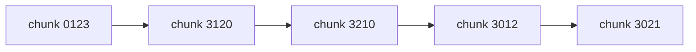

# shortcircuit

## Deskripsi
[Bzzt](https://shortcircuit.web.actf.co/)

## Points
40

## Solusi
Pada challenge ini terdapat script JavaScript seperti berikut ini.

```html
<html><head>
<meta http-equiv="content-type" content="text/html; charset=windows-1252">
        <title>Short Circuit</title>

        <script>
            const swap = (x) => {
                let t = x[0]
                x[0] = x[3]
                x[3] = t

                t = x[2]
                x[2] = x[1]
                x[1] = t

                t = x[1]
                x[1] = x[3]
                x[3] = t

                t = x[3]
                x[3] = x[2]
                x[2] = t

                return x
            }

            const chunk = (x, n) => {
                let ret = []

                for(let i = 0; i < x.length; i+=n){
                    ret.push(x.substring(i,i+n))
                }

                return ret
            }

            const check = (e) => {
                if (document.forms[0].username.value === "admin"){
                    if(swap(chunk(document.forms[0].password.value, 30)).join("") == "7e08250c4aaa9ed206fd7c9e398e2}actf{cl1ent_s1de_sucks_544e67ef12024523398ee02fe7517fffa92516317199e454f4d2bdb04d9e419ccc7"){
                        location.href="/win.html"
                    }
                    else{
                        document.getElementById("msg").style.display = "block"
                    }
                }
            }
        </script>
    </head>
    <body>
        <form>
            <input name="username" placeholder="Username" type="text">
            <input name="password" placeholder="Password" type="password">

            <input type="button" onclick="check()" value="Log in">
        </form>
        <p id="msg" style="display:none;color:red;">Username or password incorrect</p>
    
</body></html>
```

Dari code di atas dapat diketahui bahwa terdapat flag yang panjangnya 120 karakter. Terdapat fungsi yang akan memecah flag tersebut menjadi chunk sebanyak 30 karakter, kemudian setiap chunk tersebut akan ditukar isinya.

Proses pertukaran isi dari chunk tersebut seperti berikut ini.


Untuk mengembalikan flag menjadi urutannya seperti semula dapat menggunakan program JavaScript berikut ini.

```js
const swap = (x) => {
  let t = x[0];
  x[0] = x[3];
  x[3] = t;

  t = x[2];
  x[2] = x[1];
  x[1] = t;

  t = x[1];
  x[1] = x[3];
  x[3] = t;

  t = x[3];
  x[3] = x[2];
  x[2] = t;

  return x;
};

const chunk = (x, n) => {
  let ret = [];

  for (let i = 0; i < x.length; i += n) {
    ret.push(x.substring(i, i + n));
  }

  return ret;
};

var msg =
  "7e08250c4aaa9ed206fd7c9e398e2}actf{cl1ent_s1de_sucks_544e67ef12024523398ee02fe7517fffa92516317199e454f4d2bdb04d9e419ccc7";
var x = "";

while (true) {
  x = swap(chunk(msg, 30)).join("");
  msg = x;
  if (
    swap(chunk(x, 30)).join("") ==
    "7e08250c4aaa9ed206fd7c9e398e2}actf{cl1ent_s1de_sucks_544e67ef12024523398ee02fe7517fffa92516317199e454f4d2bdb04d9e419ccc7"
  ) {
    console.log(x);
    break;
  }
}
```

## Flag
### actf{cl1ent_s1de_sucks_544e67e6317199e454f4d2bdb04d9e419ccc7f12024523398ee02fe7517fffa92517e08250c4aaa9ed206fd7c9e398e2}
