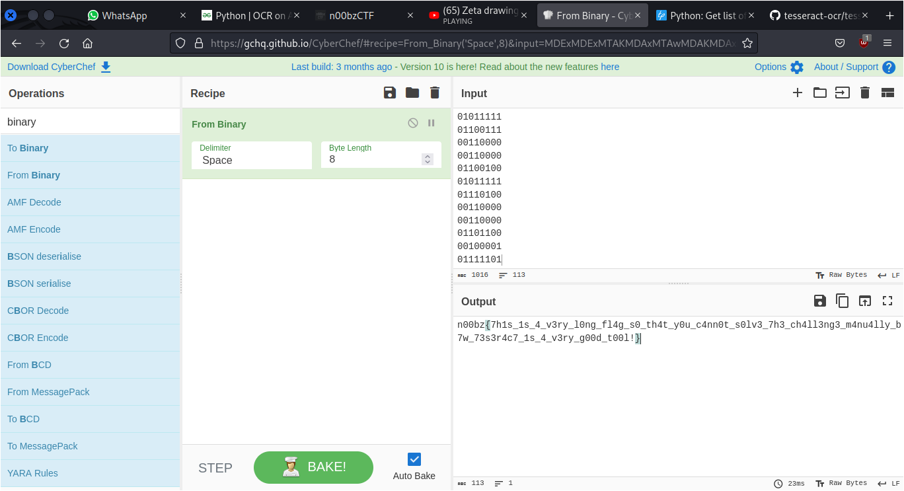

# Avenger

## Deskripsi
What houses the space stone? Author: NoobMaster

## Attachment
[flag.avi](./Challenge/flag.avi)

## Solusi
Pada challenge ini terdapat sebuah file video yang menampilkan sebuah bilangan biner setiap detik. Bilangan biner tersebut kemungkinan adalah flag berupa karakter ASCII yang telah diubah ke bentuk biner.

Langkah pertama adalah dengan mengekstrak setiap detik menjadi sebuah gambar, disini diasumsikan video tersebut mempunyai 25 fps, sehingga program akan menyimpan gambar setiap 25 frame atau setiap detik. Program tersebut bisa dilihat pada link [berikut](./extract.py).
Untuk menjalankan program tersebut seperti ini.

```
python3 extract.py flag.avi
```

Setelah menjalankan program tersebut akan terdapat folder `flag-opencv` yang merupakan gambar yang diambil setiap detik dari video. Karena gambar cukup banyak, maka kita akan menggunakan fitur dari [Teserract](https://github.com/tesseract-ocr/tesseract) untuk membaca setiap gambar dan menyimpannya ke sebuah text file.
Langkah berikutnya adalah menjalankan program [berikut](ocr.py) yang merupakan sedikit modifikasi dari link [berikut](https://www.geeksforgeeks.org/python-ocr-on-all-the-images-present-in-a-folder-simultaneously/). Hasilnya berupa setiap bilangan biner dari setiap gambar.

Hasil dari menerjemahkan bilangan biner tersebut ke ASCII.



## Flag
### n00bz{7h1s_1s_4_v3ry_l0ng_fl4g_s0_th4t_y0u_c4nn0t_s0lv3_7h3_ch4ll3ng3_m4nu4lly_b7w_73s3r4c7_1s_4_v3ry_g00d_t00l!}