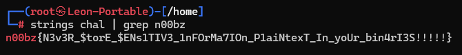

# Welcome

## Deskripsi
Can you help me pass the right input to get the flag?

Author: Heith

## Attachment
[chal](Challenge/chal)

## Solusi
Pada challenge ini diberikan suatu file binary. Hal yang pertama kita lakukan adalah mengecek menggunakan command `strings` apakah terdapat flag yang terhardcoded ke dalam binary tersebut. Ketika dilakukan pengecekan ternyata flagnya sudah terdapat di binary tersebut.

## Flag
### n00bz{N3v3R_\$torE_\$ENs1TIV3_1nFOrMa7IOn_P1aiNtexT_In_yoUr_bin4rI3S!!!!!}
