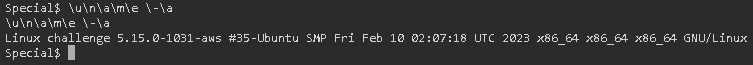

# Special

## Deskripsi
Don't power users get tired of making spelling mistakes in the shell? 
Not anymore! Enter Special, the Spell Checked Interface for Affecting Linux. 
Now, every word is properly spelled and capitalized... automatically and behind-the-scenes! 
Be the first to test Special in beta, and feel free to tell us all about how Special streamlines every development process that you face. 
When your co-workers see your amazing shell interface, just tell them: That's Special (TM)

## Points
300

## Hints
Experiment with different shell syntax

## Solusi
Shell yang diberikan secara otomatis membuat semua command yang dimasukkan menjadi diawali dengan huruf kapital dan secara otomatis melakukan auto-correction pada command tersebut.
Dicoba untuk melakukan bypass terhadap restriction yang ada pada shell tersebut dengan menggunakan panduan dari link [berikut](https://book.hacktricks.xyz/linux-hardening/bypass-bash-restrictions).

Terlihat dari hasil menambahkan backlash pada setiap huruf bisa menjalankan perintah `uname -a` tanpa adanya auto-correction pada shell.
Namun saat menjalankan perintah `ls` dengan cara di atas masih tidak bisa. Oleh karena itu dicari command lain selain `ls` yang memiliki fungsi sama, yaitu untuk menampilkan seluruh file pada current directory.
Hasil pencarian menemukan pada link [berikut](https://ubunlog.com/en/alternativas-al-comando-ls/) command `dir` tidak terkena shell restriction.

Hasilnya adalah flag berada pada directort `blargh\flag.txt`

## Flag
### picoCTF{5p311ch3ck_15_7h3_w0r57_f578af59}
