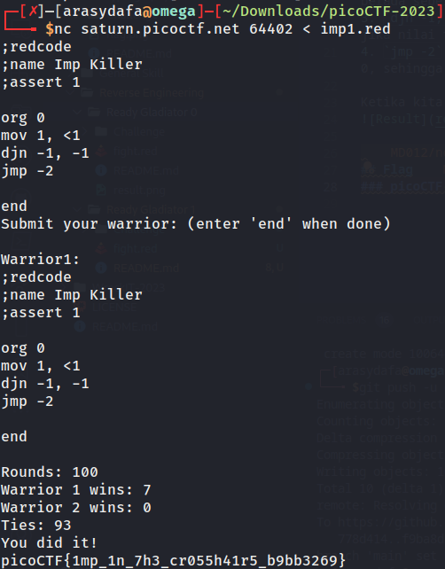

# Ready Gladiator 1

## Deskripsi
Can you make a CoreWars warrior that always loses, no ties?
Your opponent is the Imp. The source is available [here](https://artifacts.picoctf.net/c/409/imp.red). If you wanted to pit the Imp against himself, you could download the Imp and connect to the CoreWars server like this:
`nc saturn.picoctf.net 61597 < imp.red`
To get the flag, you must beat the Imp at least once out of the many rounds.

## Hint
1. You may be able to find a viable warrior in beginner docs.

## Solusi
Challenge ini merupakan suatu suatu permainan bernama `Code Wars` yang mana didasarkan pada bahasa pemrograman bernama `Red Code`. Di dalam satu permainan `Code Wars`, dua program berusaha menghentikan satu sama lain dengan cara overwrite perintah yang akan dieksekusi oleh program lainnya.

Pada challenge kali ini telah diberikan suatu file awal [Awal](Challenge/imp.red) yang mana harus kita modifikasi. Berbeda dengan challenge sebelumnya, yakni `Ready Gladiator 0`. Pada challenge kali ini kita harus membuat warrior kita cukup menang sekali saja untuk mendapatkan flagnya.

Kami mencoba memodifikasi file awal tersebut menjadi file [Fight](fight.red), baris yang kami rubah adalah:
1. `org 0` : baris ini menunjukkan bahwa program dimulai dari alamat memori 0.
2. `mov 1, <1` : baris ini merupakan instruksi move yang memindahkan nilai pada alamat memori 1 ke alamat memori 0. Notasi <1 mengacu pada alamat memori 1 yang berada sebelum alamat memori 0 dalam lingkungan Redcode.
3. `djn -1, -1` : baris ini merupakan instruksi decrement-and-jump-not-zero (DJN) yang mengurangi nilai pada alamat memori -1 dan melompat ke alamat memori -1 jika nilai tersebut bukan nol. Dalam program ini, instruksi ini menciptakan sebuah loop tak terbatas dengan mengurangi nilai pada alamat memori -1 terus menerus.
4. `jmp -2` : baris ini merupakan instruksi jump yang melompat ke alamat memori -2. Dalam program ini, instruksi ini menyebabkan prosesor kembali ke alamat memori 0, sehingga menciptakan sebuah loop tak terbatas.

Ketika kita menjalankan koneksi ke CoreWars server dengan file [Fight](fight.red) sebagai inputnya dan kita dapatkan flagnya.

## Flag
### picoCTF{1mp_1n_7h3_cr055h41r5_b9bb3269}
