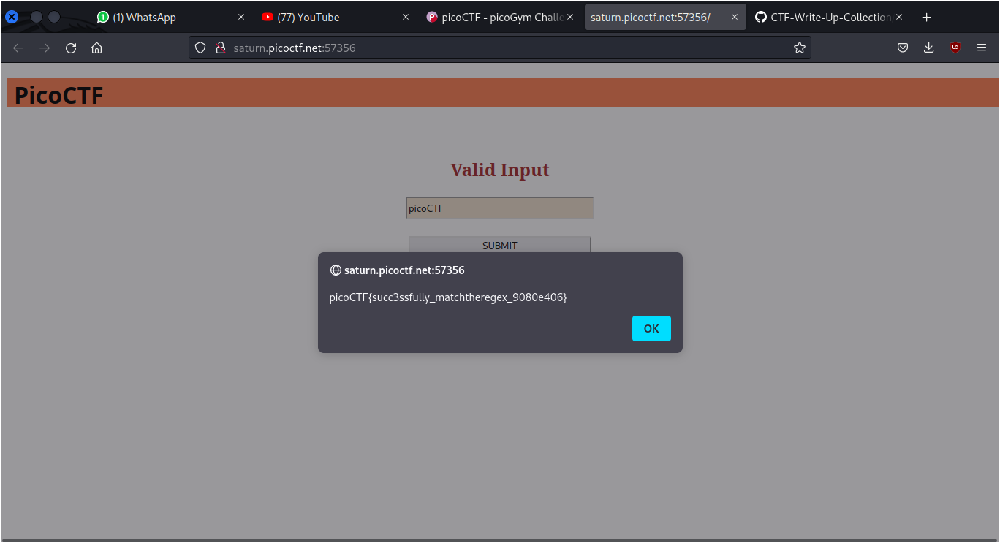

# MatchTheRegex

## Deskripsi
How about trying to match a regular expression

## Points
100

## Hints
Access the webpage and try to match the regular expression associated with the text field

## Solusi
Diberikan sebuah website dengan sebuah input text field

Dari deskripsi challenge diberikan clue bahwa harus mencoba untuk menyamakan input text field dengan regex. Flag ditemukan dengan memasukkan `picoCTF` sebagai input dari text field.

## Flag
### picoCTF{succ3ssfully_matchtheregex_9080e406}