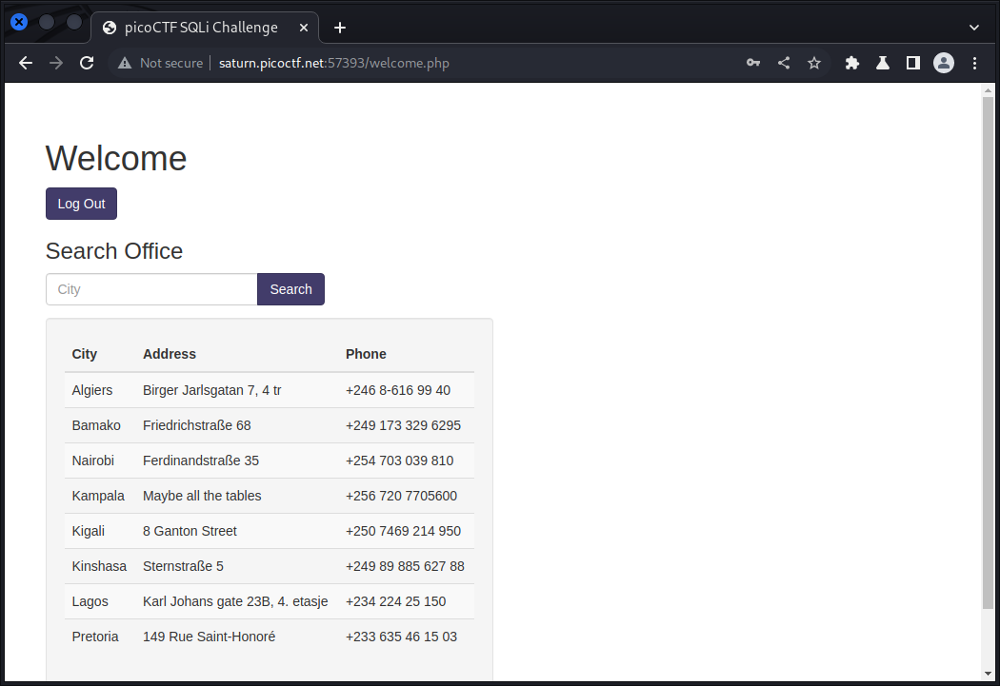

# More SQLi

## Deskripsi
Can you find the flag on this website.

## Points
200

## Hints
SQLiLite

## Solusi
Hint yang diberikan sudah cukup jelas bahwa challenge yang diberikan ini memiliki vulnerability sql injection atau SQLi. Payload yang digunakan adalah
```sql
admin' or 1=1;
```

Dari payload tersebut, sudah berhasil login seperti berikut ini.



Dari tampilan setelah login diberikan lagi sebuah tabel dengan fungsi pencarian berdasarkan field `City`. Disini saya kira terdapat vulnerability lagi untuk UNION SQL injection, tapi ternyata tidak ada.

Sempat stuck tidak mendapat petunjuk, dicoba menggunakan `burpsuite` untuk intercept koneksi, yang mungkin flag terdapat pada halaman yang lain seperti pada challenge findme. Ternyata benar flag terdapat pada redirection sebelum masuk ke halaman `welcome.php`


## Flag
### picoCTF{G3tting_5QL_1nJ3c7I0N_l1k3_y0u_sh0ulD_3b0fca37}

