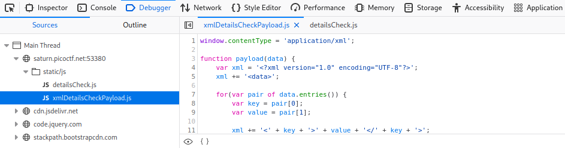
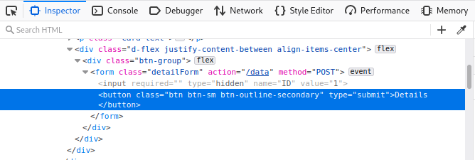
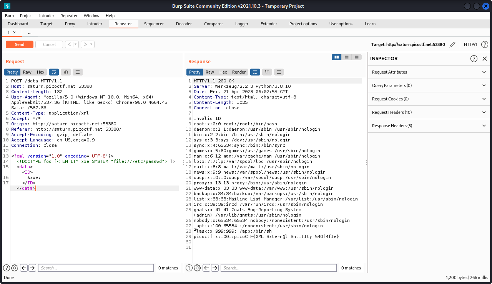

# SOAP

## Deskripsi
The web project was rushed and no security assessment was done. <br>
Can you read the /etc/passwd file?

## Points
100

## Hints
XML external entity Injection

## Solusi
Berdasarkan hint yang diberikan ada petunjuk bahwa website untuk challenge ini memiliki vulnerability XXE(XML Eternal Entity Injection). 
Referensi mengenai XXE bisa dibaca melalui sumber yang disediakan oleh [PortSwigger](https://portswigger.net/web-security/xxe)
Namun sebelum kita bisa memasukkan payload pada web tersebut, harus dicari terlebih dahulu cara untuk mengirimkan payload (melalui form atau submit button).

Saat melihat source code dari web tersebut, ditemukan file `xmlDetailsCheckPayload.js` yang memiliki fungsi `payload()` untuk mengirimkan data yang telah di-encoding UTF-8 setelah melalui proses XML encoding.



Dari potongan source code tersebut sudah ditemukan bagaimana caranya kita bisa mengirimkan XXE payload pada web, yaitu pada tag `<data>`.
Untuk mengirimkan payload pada tag `<data>` perlu dimodifikasi POST request saat klik pada button `Details`.


  
Untuk mengirimkan payload, disini digunakan `burpsuite` untuk memodifikasi POST request dengan memasukkan payload untuk membaca file `/etc/passwd`.
Payload yang digunakan adalah 

```html
<?xml version="1.0" encoding="UTF-8"?>
  <!DOCTYPE foo [ <!ENTITY xxe SYSTEM "file:///etc/passwd"> ]>
  <data>
    <ID>
      &xxe;
    </ID>
  </data>
```
  
Hasilnya adalah kita bisa membaca file `/etc/passwd` melalui XXE dan dalam file tersebut terdapat flag yang dicari



## Flag
### picoCTF{XML_3xtern@l_3nt1t1ty_540f4f1e}
