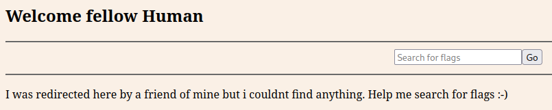
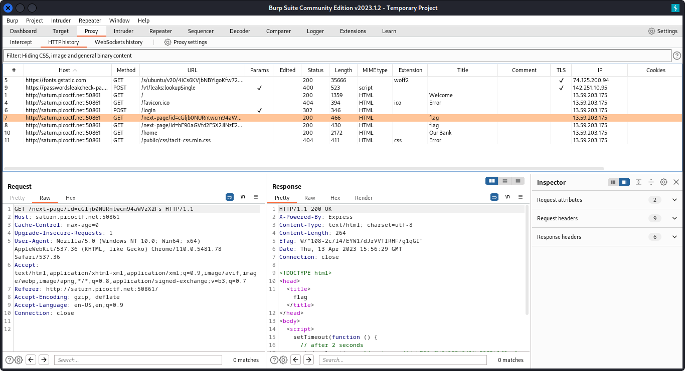

# findme

## Deskripsi
Help us test the form by submiting the username as `test` and password as `test!`

## Points
100

## Hints
any redirections?

## Solusi
Saat mencoba untuk login ke web dari challenge ini menggunakan username `test` dan password `test!` diarahkan ke halaman dengan input text field untuk mencari flag. Flag tidak akan ditemukan dengan memasukkan input ke dalam text field itu.
Namun jika dicermati dari tampilan web tersebut, ada sebuah clue yang menunjukkan bahwa adanya redirect pada website tersebut.

Digunakan `burpsuite` untuk intercept setiap request dan memudahkan untuk mencari redirection yang dimaksud.
Pada tampilan `burpsuite` menunjukkan adanya halaman lain yang diakses setelah berhasil login sebelum sampai kepada path `/home` dan title dari halaman tersebut adalah flag.

Ada dua halaman yang diakses sebelum berhasil sampai ke `/home`. Jika dilihat nilai dari `id` seperti di-encode menggunakan base64. Hasil decoding dari kedua `id` seperti berikut ini.

## Flag
### picoCTF{proxies_all_the_way_be716d8e}