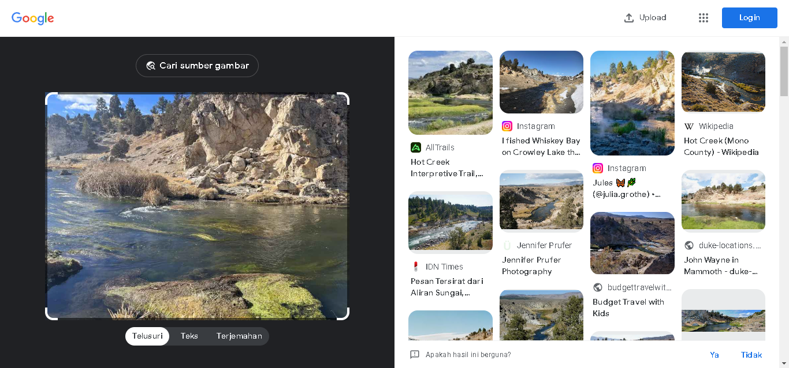
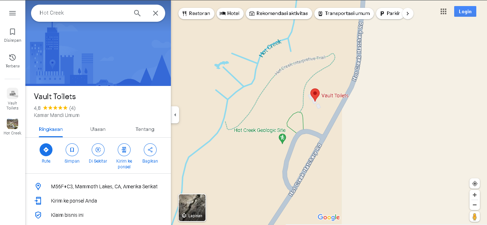
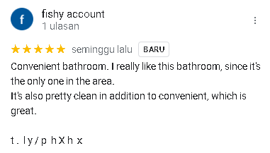
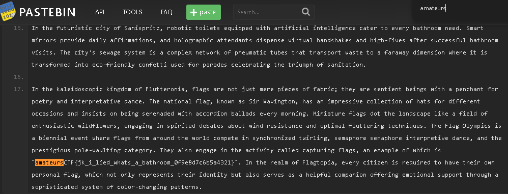

# bathroom-break

## Description

I was on an in-state skiing trip with my family when we decided to go out and see some sights.  
I remember needing to go to the bathroom near where these pictures were taken and then leaving a review. Can you find this review for me?

## Attachments
[493B0E69-C226-4171-B565-2E68ECF25A29.jpg](./Challenge/493B0E69-C226-4171-B565-2E68ECF25A29.jpg)
[67BC754A-C818-4358-8E4F-16DF8B2230E8.jpg](./Challenge/67BC754A-C818-4358-8E4F-16DF8B2230E8.jpg)

## Solution
To find the location where the picture was taken, we can use Google image search.
By using Google image search we find an answer where the picture was located, it was at Hot Creek.

After find the location where of that pictures, we can search Hot Creek in Google maps to search any flag or something related to flag in reviews.
But after spending some time to search for reviews in Hot Creek or Hot Creek Geologic Site, we can't find any reviews that lead us to the flag for this challenge.
Then I remember about the description of this challenge, the person that captures these pictures said he/she need to go the bathroom near these pictures were taken.
After a few zoom in, we found a Vault Toilets near Hot Creek Geologic Site.

When we look at the reviews of this place, we found review from `fishy account` that might lead to the flag of this challenge.

Following the link in that review, we will find a pastebin that contain a flag in it.

## Flag
`amateursCTF{jk_i_lied_whats_a_bathroom_0f9e8d7c6b5a4321}`
