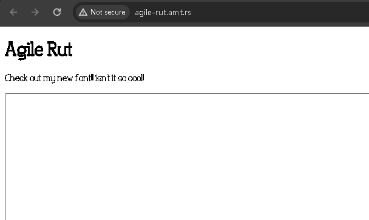

# agile-rut

## Description
check out this cool font i made! <br>
http://agile-rut.amt.rs

hint: if you get something that looks like the flag try pasting it into the box.

## Solution
For this challenge we don't have any attachment attached to it, so let's check the webpage first.
This is how the webpage looks like.



There is textbox in that webpage. 
Let's check the source code, maybe there's something interesting.

```html
<!DOCTYPE html>
<html lang="en">

<head>
    <meta charset="UTF-8">
    <meta name="viewport" content="width=device-width, initial-scale=1.0">
    <title>agile rut playground</title>
    <style>
        @font-face {
            font-family: 'Agile Rut';
            src: url('agile-rut.otf');
        }
        * {
            font-family: 'Agile Rut';
        }
        textarea {
            font-size: 24px;
        }
    </style>
</head>

<body>
    <h1>Agile Rut</h1>
    <p>Check out my new font!! isn't it so cool!</p>
    <textarea cols="100" rows="100"></textarea>
</body>

</html>
```

There're no something in particular about this webpage, even the textbox is not send any data to the backend server.
The only thing that we can inspect more is just the custom font, which is `agile-rut.otf`.
To download the custom font, we can navigate to this link http://agile-rut.amt.rs/agile-rut.otf

For this challenge, we can use this [link](https://www.glyphrstudio.com/app/) to edit the custom font.
You will find the flag in Ligatures menu.


## Flag
`amateursctf{0k_but_1_dont_like_the_jbmon0_===}`
