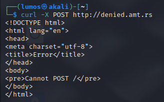
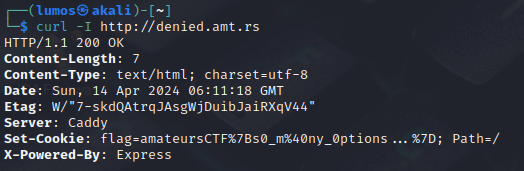

# denied

## Description
what options do i have?
<br>
http://denied.amt.rs

## Attachment
[index.js](./Challenge/index.js)

## Solution
Before we try to open the webpage challenge, let's see the Javascript code first.

```js
const express = require('express')
const app = express()
const port = 3000

app.get('/', (req, res) => {
  if (req.method == "GET") return res.send("Bad!");
  res.cookie('flag', process.env.FLAG ?? "flag{fake_flag}")
  res.send('Winner!')
})

app.listen(port, () => {
  console.log(`Example app listening on port ${port}`)
})
```

From the source code, if we send a request using GET method it will return `Bad!`. 
Then let's try other HTTP request method, first let's try using POST.

```sh
curl -X POST http://denied.amt.rs/
```

Using the POST method it will return an error like this.



We can't use GET or POST method for this website, but what is the other available HTTP request method for this website?
Well, the answer is from the description of this challenge: `what options do i have?`.
It tells us about what available options for this website. 
HTTP request method have an OPTIONS method for requesting the permitted request method for website or URL.

```sh
curl -X OPTIONS http://denied.amt.rs/
```

The permitted request for this challenge is `GET` and `HEAD`.
So, it leave us with `HEAD` method because `GET` method will not return the flag.
For using `HEAD` method in curl, run this following command:

```
curl -I http://denied.amt.rs
```



The flag is in URL encoded format, you need to decode it first.

## Flag
`amateursCTF{s0_m@ny_0ptions...}`
