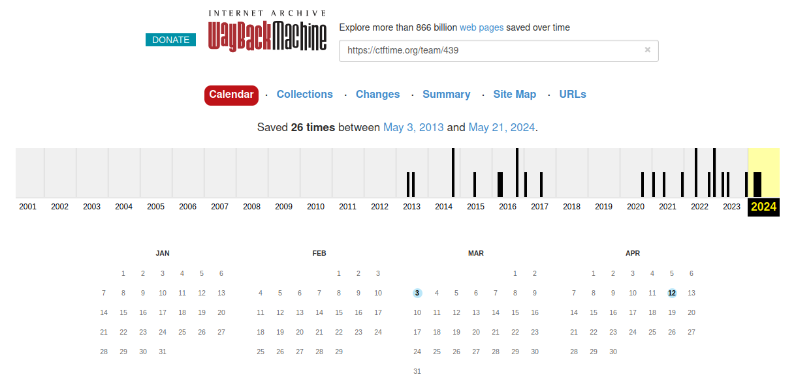
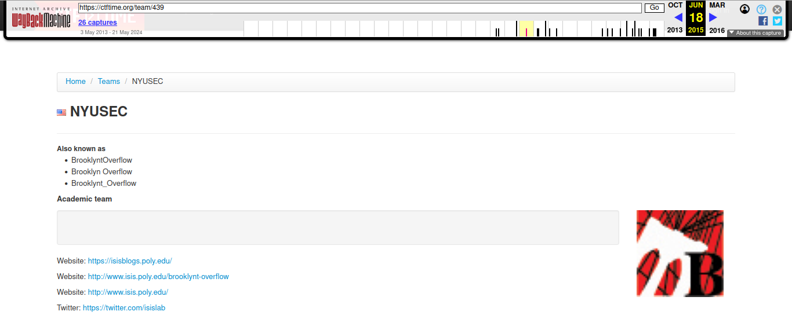

# OSIRIS Trivia

## Description

Weren't always known as the Offensive Security, Incidence Response, and Internet Security Lab! Can you find out what our old domain was? Do not include the network protocol. Wrap your answer with `csawctf{}`.

author: bbtc33

## Solution

I need to find the old domain of OSIRIS to solve this challenge. What can I do to find the old domain of OSIRIS? I think I can use the information of the organizer of this CTF at [CTFtime](https://ctftime.org). I search about CSAW CTF from CTFtime and here's the result of this year [CSAW CTF qualification round](https://ctftime.org/event/2398).

From the CTF event in the CTFtime earlier, I got the event organizers for CSAW CTF. NYUSEC is the event organizer for CSAW CTF. You can find the information about the event organizer from CTFtime and here's the [link](https://ctftime.org/team/439).

After I got the event organizer of CSAW CTF, which is NYUSEC and also it called as OSIRIS Lab. Great, now I can use the link of this event organizer on CTFtime to search the history archived by using [Wayback Machine](https://web.archive.org/). The result from Wayback Machine shows that the link for this event organizer have been archived over more than ten years.

I choose the archived version from 2015 and here's the result.

In the archived version, the website for OSIRIS Lab is [www.isis.poly.edu](http://www.isis.poly.edu/). But, when I tried to submit this as a flag it's incorrect. The correct domain for the flag is `isis.poly.edu`.

## Flag
`csawctf{isis.poly.edu}`
