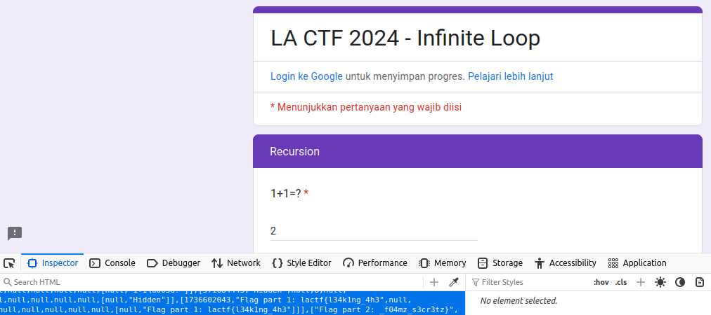

# infinite loop

## Description
I found this google form but I keep getting stuck in a loop! Can you leak to me the contents of form and the message at the end so I can get credit in my class for submitting? Thank you!

[Click Me](https://docs.google.com/forms/d/e/1FAIpQLSfgUDWRzgkSC2pppOx_SVdw1E9bpVVWUkvQssmWza11pufMUQ/viewform?usp=sf_link)

## Solution
This challenge is using Google Form, but when you insert a value after inserting your team name it will loop infinitely.
To solve this challenge, we need to view the source code of the form using inspect element.
At script tag, you will find a `FP_PUBLIC_LOAD_DATA` variable that contains flag.

## Flag
`lactf{l34k1ng_4h3_f04mz_s3cr3tz}`
