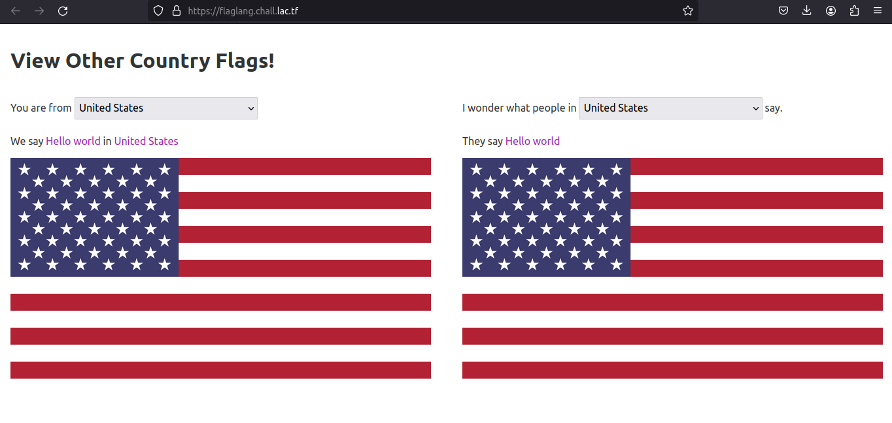
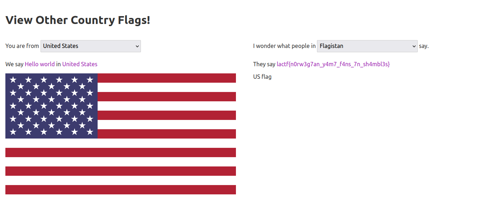
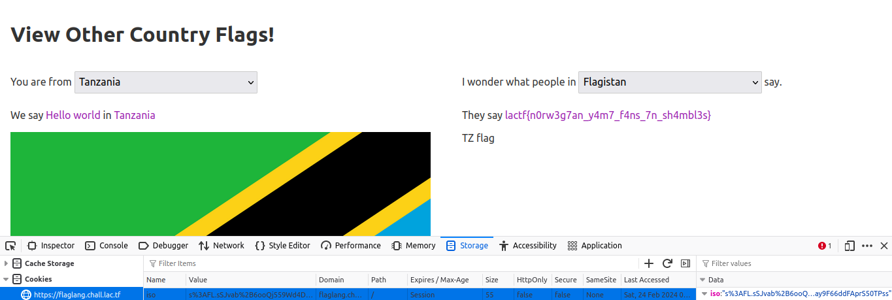

# flaglang

## Description
Do you speak the language of the flags?

[flaglang.chall.lac.tf](https://flaglang.chall.lac.tf/)

## Attachment
[flaglang.zip](./Challenge/flaglang.zip)

## Solution
The web page for this challenge will translating a language from certain country to another language of a certain country.



Let's take a look at the attachment for this challenge. We just need to focus on `app.js`, `countries.yaml`, and `flag.js`.
First, this is the source code of the `app.js`

```js
const crypto = require('crypto');
const fs = require('fs');
const path = require('path');
const express = require('express');
const cookieParser = require('cookie-parser');
const yaml = require('yaml');

const yamlPath = path.join(__dirname, 'countries.yaml');
const countryData = yaml.parse(fs.readFileSync(yamlPath).toString());
const countries = new Set(Object.keys(countryData));
const countryList = JSON.stringify(btoa(JSON.stringify(Object.keys(countryData))));

const isoLookup = Object.fromEntries([...countries].map(name => [
  countryData[name].iso,
  {...countryData[name], name }
]));


const app = express();

const secret = crypto.randomBytes(32).toString('hex');
app.use(cookieParser(secret));

app.use('/assets', express.static(path.join(__dirname, 'assets')));

app.get('/switch', (req, res) => {
  if (!req.query.to) {
    res.status(400).send('please give something to switch to');
    return;
  }
  if (!countries.has(req.query.to)) {
    res.status(400).send('please give a valid country');
    return;
  }
  const country = countryData[req.query.to];
  if (country.password) {
    if (req.cookies.password === country.password) {
      res.cookie('iso', country.iso, { signed: true });
    }
    else {
      res.status(400).send(`error: not authenticated for ${req.query.to}`);
      return;
    }
  }
  else {
    res.cookie('iso', country.iso, { signed: true });
  }
  res.status(302).redirect('/');
});

app.get('/view', (req, res) => {
  if (!req.query.country) {
    res.status(400).json({ err: 'please give a country' });
    return;
  }
  if (!countries.has(req.query.country)) {
    res.status(400).json({ err: 'please give a valid country' });
    return;
  }
  const country = countryData[req.query.country];
  const userISO = req.signedCookies.iso;
  if (country.deny.includes(userISO)) {
    res.status(400).json({ err: `${req.query.country} has an embargo on your country` });
    return;
  }
  res.status(200).json({ msg: country.msg, iso: country.iso });
});

app.get('/', (req, res) => {
  const template = fs.readFileSync(path.join(__dirname, 'index.html')).toString();
  const iso = req.signedCookies.iso || 'US';
  const country = isoLookup[iso];
  res
    .status(200)
    .type('html')
    .send(template
      .replaceAll('$msg$', country.msg)
      .replaceAll('$name$', country.name)
      .replaceAll('$iso$', country.iso)
      .replaceAll('$countries$', countryList)
    );
});

app.listen(3000);
```

So, here's how the code will work:
- The code will read the content of `countries.yaml` that contain the countries name, message, and ISO 3166 country codes for each countries.
- The code will generate an `iso` cookies if user switch the country from the default country which is United States to another country. In the default state, there will be no cookies.
- If the user switch or change the country it will execute the `/switch` route and `/view` route.
- After changing the country it will shows the message from `countries.yaml` if the country is not in deny list.

If we check `countries.yaml`, there will be interesting country called Flagistan that the ISO code is not available in ISO 3166 country codes.
This is probably the country that contains flag. But all countries are included in deny list for this country.

```yaml
Flagistan:
  iso: FL
  msg: "<REDACTED>"
  password: "<REDACTED>"
  deny: 
    ["AF","AX","AL","DZ","AS","AD","AO","AI","AQ","AG","AR","AM","AW","AU","AT","AZ","BS","BH","BD","BB","BY","BE","BZ","BJ","BM","BT","BO","BA","BW","BV","BR","IO","BN","BG","BF","BI","KH","CM","CA","CV","KY","CF","TD","CL","CN","CX","CC","CO","KM","CG","CD","CK","CR","CI","HR","CU","CY","CZ","DK","DJ","DM","DO","EC","EG","SV","GQ","ER","EE","ET","FK","FO","FJ","FI","FR","GF","PF","TF","GA","GM","GE","DE","GH","GI","GR","GL","GD","GP","GU","GT","GG","GN","GW","GY","HT","HM","VA","HN","HK","HU","IS","IN","ID","IR","IQ","IE","IM","IL","IT","JM","JP","JE","JO","KZ","KE","KI","KR","KP","KW","KG","LA","LV","LB","LS","LR","LY","LI","LT","LU","MO","MK","MG","MW","MY","MV","ML","MT","MH","MQ","MR","MU","YT","MX","FM","MD","MC","MN","ME","MS","MA","MZ","MM","NA","NR","NP","NL","AN","NC","NZ","NI","NE","NG","NU","NF","MP","NO","OM","PK","PW","PS","PA","PG","PY","PE","PH","PN","PL","PT","PR","QA","RE","RO","RU","RW","BL","SH","KN","LC","MF","PM","VC","WS","SM","ST","SA","SN","RS","SC","SL","SG","SK","SI","SB","SO","ZA","GS","ES","LK","SD","SR","SJ","SZ","SE","CH","SY","TW","TJ","TZ","TH","TL","TG","TK","TO","TT","TN","TR","TM","TC","TV","UG","UA","AE","GB","US","UM","UY","UZ","VU","VE","VN","VG","VI","WF","EH","YE","ZM","ZW"]
```

Now, let's check the `flag.js` source code.

```js
const $ = (...args) => document.querySelectorAll(...args);
const H = (...args) => document.createElement(...args);

// add each country to each select menu
$('select').forEach(select => {
  for (const country of countries) {
    const option = H('option');
    option.value = country;
    option.textContent = country;
    select.appendChild(option);
  }
});

// set value of my country select to what cookies say
const myName = $('.your-flag .name')[0].textContent;
$('.your-flag select')[0].value = myName;
$('.your-flag select')[0].addEventListener('change', (e) => {
  const newName = e.target.value;
  location.href = '/switch?to=' + encodeURIComponent(newName);
});

// set my flag
const myISO = $('.iso')[0].textContent;
const flagSrc = iso => `https://flagpedia.net/data/flags/w1160/${iso.toLowerCase()}.webp`;
$('.your-flag img')[0].src = flagSrc(myISO);

// set value of country we are viewing
$('.other-flag select')[0].addEventListener('change', async (e) => {
  const newCountry = e.target.value;
  const resp = await fetch('/view?country=' + encodeURIComponent(newCountry))
    .then(r => r.json());
  if ('err' in resp) {
    $('.error')[0].style.display = 'block';
    $('.error')[0].textContent = resp.err;
  }
  else {
    $('.error')[0].style.display = 'none';
    $('.other-flag span')[0].textContent = resp.msg;
    $('.other-flag img')[0].src = flagSrc(resp.iso);
  }
});

$('.other-flag select')[0].value = myName;
$('.other-flag img')[0].src = flagSrc(myISO);
```

Basically the `flag.js` contained the function for `/switch` route and `/view` route.

For completing this challenge there are two ways, which is unintended way and intended way.

### Unintended solution
The unintended way to get the flag for this challenge is simply by choosing `Flagistan` in dropdown list for "I wonder what people in" dropdown list, when we still not change the default country in "You are from" dropdown list.



This conditions can happened because there's flaw logic in the source code of `app.js`.

```js
app.get('/', (req, res) => {
  const template = fs.readFileSync(path.join(__dirname, 'index.html')).toString();
  const iso = req.signedCookies.iso || 'US';
  const country = isoLookup[iso];
  res
    .status(200)
    .type('html')
    .send(template
      .replaceAll('$msg$', country.msg)
      .replaceAll('$name$', country.name)
      .replaceAll('$iso$', country.iso)
      .replaceAll('$countries$', countryList)
    );
});

app.get('/view', (req, res) => {
  if (!req.query.country) {
    res.status(400).json({ err: 'please give a country' });
    return;
  }
  if (!countries.has(req.query.country)) {
    res.status(400).json({ err: 'please give a valid country' });
    return;
  }
  const country = countryData[req.query.country];
  const userISO = req.signedCookies.iso;
  if (country.deny.includes(userISO)) {
    res.status(400).json({ err: `${req.query.country} has an embargo on your country` });
    return;
  }
  res.status(200).json({ msg: country.msg, iso: country.iso });
});
```

We could see that by default the application will not generate an `iso` cookies, but just replace the value for iso as `US`.
Then if we looked at `/view` route, there's a condition if the country from client is included in deny list or not, by checking the value of `iso` cookies from `req.signedCookies.iso`.
Because by default client don't have this cookies, and then the condition will be skipped and we could see the content of flag, even though US is included in deny list of Flagistan.

### Intended solution
I called this method more intended because we need to bypass conditions in `/switch` and `/view` route for checking the deny list for Flagistan.
This is the code for `/switch` route and `/view` route.

```js
app.get('/switch', (req, res) => {
  if (!req.query.to) {
    res.status(400).send('please give something to switch to');
    return;
  }
  if (!countries.has(req.query.to)) {
    res.status(400).send('please give a valid country');
    return;
  }
  const country = countryData[req.query.to];
  if (country.password) {
    if (req.cookies.password === country.password) {
      res.cookie('iso', country.iso, { signed: true });
    }
    else {
      res.status(400).send(`error: not authenticated for ${req.query.to}`);
      return;
    }
  }
  else {
    res.cookie('iso', country.iso, { signed: true });
  }
  res.status(302).redirect('/');
});

app.get('/view', (req, res) => {
  if (!req.query.country) {
    res.status(400).json({ err: 'please give a country' });
    return;
  }
  if (!countries.has(req.query.country)) {
    res.status(400).json({ err: 'please give a valid country' });
    return;
  }
  const country = countryData[req.query.country];
  const userISO = req.signedCookies.iso;
  if (country.deny.includes(userISO)) {
    res.status(400).json({ err: `${req.query.country} has an embargo on your country` });
    return;
  }
  res.status(200).json({ msg: country.msg, iso: country.iso });
});
```

The application will generate an `iso` cookies if we change the country in "You are from" dropdown list. 
In `/switch` route the password from cookies will be check with the password in `countries.yaml`. We know that for Flagistan, the msg and password value is redacted.
If the password from cookies and from `countries.yaml` is same then the application will generate a signed cookies, which is done by using cookie-parser middleware in express js.
And you already know that the result is `iso` cookies.
Signed cookies from cookie-parser middlware has a prefixed value with `s:`. From this we know that the value of `iso` cookies will looks like this.

```
s:US.signed-value

# or in URL-encoded value
s%3AUS.signed-value
```

We know that only Flagistan have a password in the `countries.yaml` file, while other countries is not. 
Then from `/view` route there's a condition to check if the country is included in deny list by checking the `iso` cookies.
To bypass this condition, we need to leveraging the authentication condition in `/switch` route if the country doesn't have a password in `countries.yaml` list.
If the country doesn't have a password it will automatically generate the `iso` cookies.
The next step is altering the value of `iso` cookies, which is looks like this.

```
s%3AFL.signed-value
```

After altering the value of `iso` cookies, we need to select Flagistan from "I wonder what people in" dropdown list.



## Flag
`lactf{n0rw3g7an_y4m7_f4ns_7n_sh4mbl3s}`
