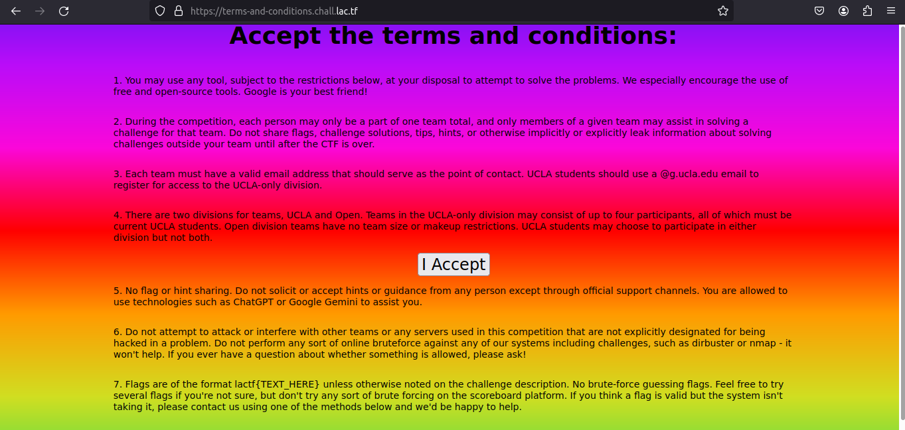

# terms-and-conditions

## Description
Welcome to LA CTF 2024! All you have to do is accept the terms and conditions and you get a flag!

[terms-and-conditions.chall.lac.tf](https://terms-and-conditions.chall.lac.tf/)

## Solution
The website provided shows the terms and conditions for LA CTF, this is how the web page looks like.



When you try to agree to the terms and conditions by clicking the "I Accept" button, the button will move when the cursor approaches the button.
It's intended to make the "I Accept" cannot be clicked using Javascript.

Let's take a look at the source code of the web page provided. 
When you try to open the source code using inspect element the web page will return a message "NO CONSOLE ALLOWED", but it won't if you open the source code using View page source.

```js
let width = window.innerWidth;
let height = window.innerHeight;
setInterval(function() {
  if (window.innerHeight !== height || window.innerWidth !== width) {
    document.body.innerHTML = "<div><h1>NO CONSOLE ALLOWED</h1></div>";
    height = window.innerHeight;
    width = window.innerWidth;
  }
}, 10);
```

From the source code there is file `analytics.js` that might be lead us to the flag in this challenge.
The source code of the `analytics.js file` is quite long and the source code has been obfuscated. You can find the source code in [here](./analytics.js)

To deobfuscate the code, I used [deobfuscate.io](https://deobfuscate.io/). 
When deobfuscate the code, the deobfuscator recognized the code was obfuscated using [obfuscator.io](https://obfuscator.io/) and will notify you to redirect for the deobfuscator.
After redirected, copy paste again the source code of `analytics.js`. The deobfuscation result is looks like this.

```js
document.getElementById("accept").addEventListener("click", () => {
  const _0x4eb4e0 = document.getElementById("mainscript");
  if (!_0x4eb4e0 || _0x4eb4e0.innerText.length < 1000) {
    alert("silly you... you don't get to disable javascript...");
  } else {
    alert("ob`wexwkbw\\avwwlm\\tbp\\gfejmjwfoz\\mlw\\lmf\\le\\wkf\\wfqnp~".split``.map(_0x286792 => String.fromCharCode(_0x286792.charCodeAt(0) ^ 3)).join``);
  }
});
```

We just need to focus on this part, because it seems contains the flag we are looking for.

```js
alert("ob`wexwkbw\\avwwlm\\tbp\\gfejmjwfoz\\mlw\\lmf\\le\\wkf\\wfqnp~".split``.map(_0x286792 => String.fromCharCode(_0x286792.charCodeAt(0) ^ 3)).join``);
```

Change the code like this to obtain the flag.

```js
console.log("ob`wexwkbw\\avwwlm\\tbp\\gfejmjwfoz\\mlw\\lmf\\le\\wkf\\wfqnp~".split``.map(_0x286792 => String.fromCharCode(_0x286792.charCodeAt(0) ^ 3)).join``);
```

## Flag
`lactf{that_button_was_definitely_not_one_of_the_terms}`

