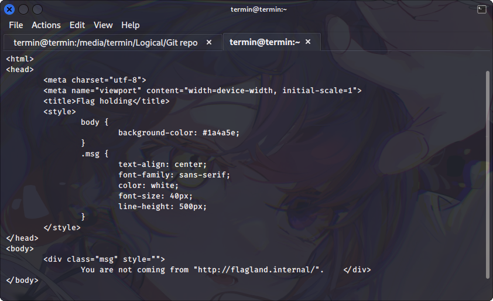
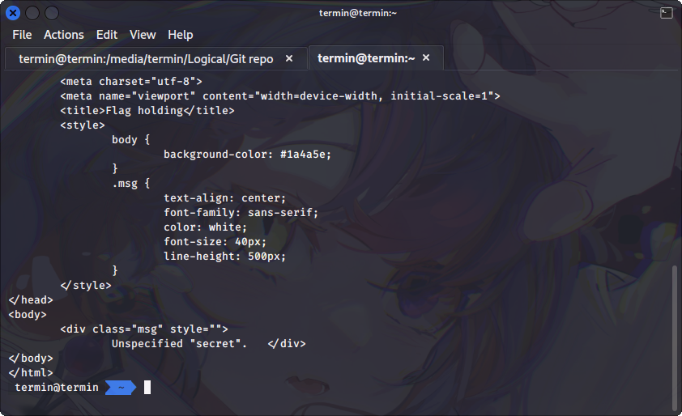
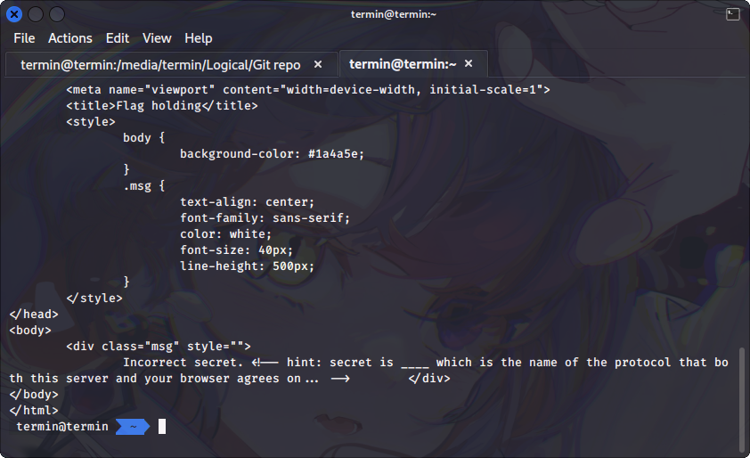
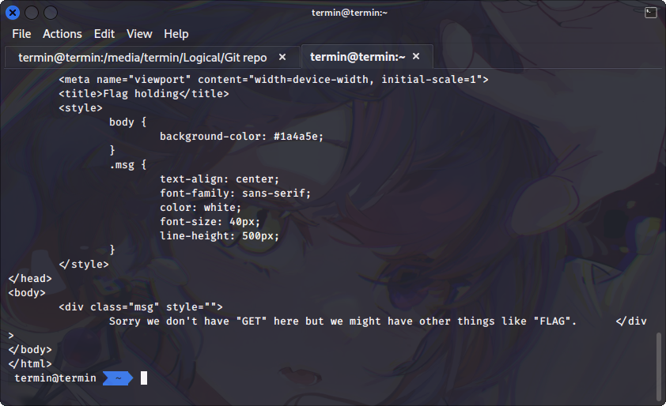
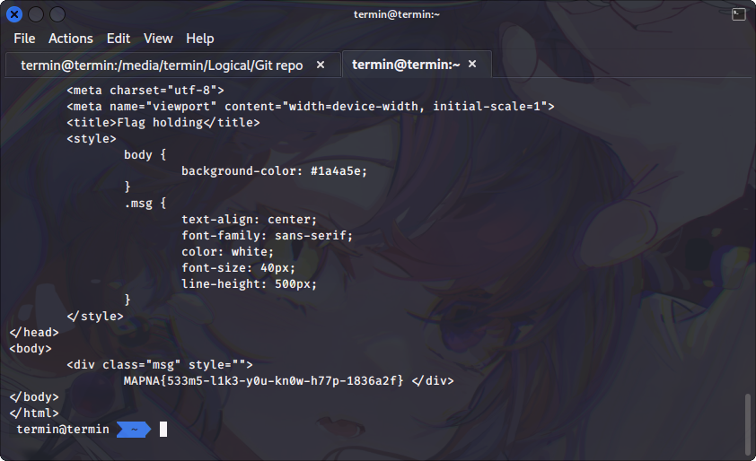

# Flag Holding

## Description

Hopefully you know how web works...

http://18.184.219.56:8080/

## Solution

First step to solve this challenge is by analyzing the source code for this challenge. In this case, I used `curl` command.

```shell
curl http://18.184.219.56:8080/
```



From that command I got something interesting. The web server said that I'm not coming from `http://flagland.internal/`, this indicate that we should open this web server by set the Referer header from `http://flagland.internal/`. To send the the Referer header using curl, I used this command.

```shell
curl -H "Referer: http://flagland.internal/" http://18.184.219.56:8080/
```



From the above image the web server send another response, it told me about unspecified `secret`. This unspecified `secret` might be URL parameter. I'm not really sure about, but I just try this first and see the result.

```shell
curl -H "Referer: http://flagland.internal/" http://18.184.219.56:8080/?secret=
```



So that `secret` in here is exactly an URL parameter, but the web server told me that the secret is incorrect. But, from the response we know that the correct value for `secret` is http. Let's execute this command to show the next response from the web server.

```shell
curl -H "Referer: http://flagland.internal/" http://18.184.219.56:8080/?secret=http
```



Alright, so the value for `secret` URL parameter is correct and then this time the web server told us that it don't have `GET` but it have `FLAG` instead. This is should the HTTP request method, the web server expect us to set the request to `FLAG`. Execute this command below to change the request method to `FLAG`.

```shell
curl -X FLAG -H "Referer: http://flagland.internal/" http://18.184.219.56:8080/?secret=http
```



After change the request method to `FLAG` we got the flag for this challenge.

## Flag
`MAPNA{533m5-l1k3-y0u-kn0w-h77p-1836a2f}`