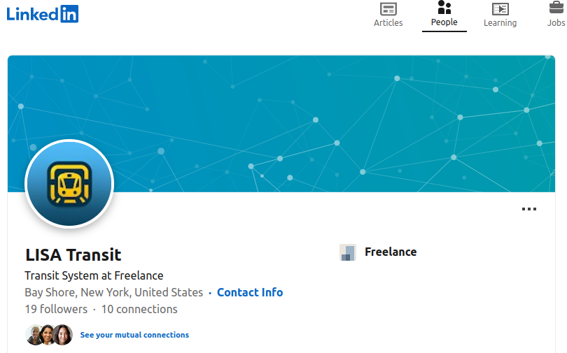
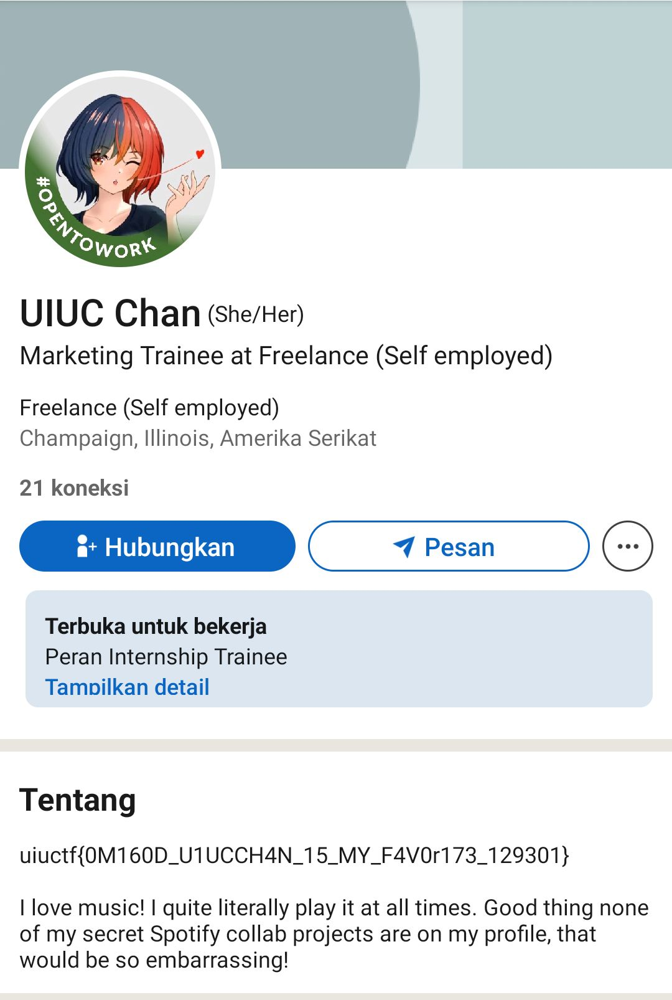

# An Unlikely Partnership

## Description

It appears that the Long Island Subway Authority (LISA) has made a strategic business partnership with a surprise influencer! See if you can figure out who.

This is part two of a three-part OSINT suite including Hip With the Youth, An Unlikely Partnership, and The Weakest Link. This challenge is possible without Hip With the Youth but will be easier if you start there.

## Solution

From the challenge of [Hip With the Youth](../Hip%20With%20the%20Youth/README.md) I got the [Threads account](https://www.threads.net/@longislandsubwayauthority?xmt=AQGzEdCZpdsdmB0SA2zB7FMD9MRqyQxb5mdcfFYryXwbeKM) of LISA and in this account you can found another LISA's account that are linked in the bio section. In the bio section there's a Linkedin account, you can check the account in [here](https://www.linkedin.com/in/long-island-subway-authority/).

After I found the LISA's Linkedin account, it seems we need to know about the network connection of this account because this challenge description told us about a strategic business partnership. As you probably know, that we can't see the full list of network connection of Linkedin account.

Then I searching for more information in this Linkedin account and I found the Skills section of this account is interesting. One that really catches my eyes was the Transportation skill because this skill is recommended by someone. UIUC Chan is the one that recommended this skill and you can found the account in [here](https://www.linkedin.com/in/uiuc-chan). Luckily, I don't need an extra step to search the flag in this account because the flag is in her About section.

## Flag

`uiuctf{0M160D_UIUCCH4N_15_MY_F4VOr173_129301}`