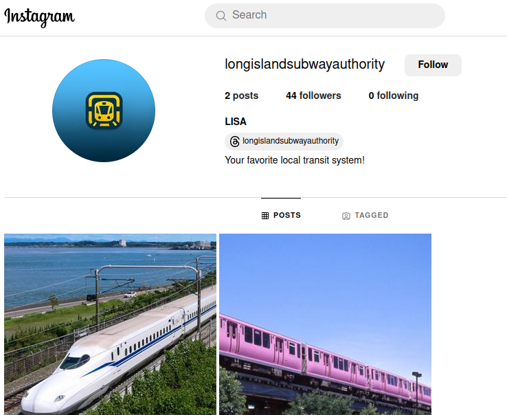
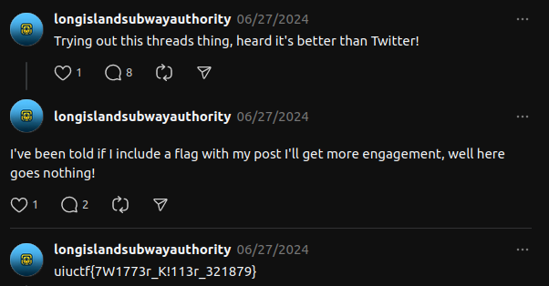

# Hip With the Youth

## Description

The Long Island Subway Authority (LISA), in an attempt to appeal to the younger generations, has begun experimenting with social media! See if you can find a way to a flag through their Instagram.

This is part one of a three-part OSINT suite including Hip With the Youth, An Unlikely Partnership, and The Weakest Link. I recommend starting here!

## Solution

As the challenge description said, we need to look up the Long Island Subway Authority (LISA) account on Instagram. Using search in Instagram, I got the account of LISA [account](https://www.instagram.com/longislandsubwayauthority/). From this account we got 2 posts, but those posts not gave us a single clue to the flag for this challenge.

From the Instagram account bio, there's a linked to [Threads](https://www.threads.net/@longislandsubwayauthority?xmt=AQGzEdCZpdsdmB0SA2zB7FMD9MRqyQxb5mdcfFYryXwbeKM) account. From one of the posts of this Threads account, you can found the flag in its comments section.

## Flag

`uiuctf{7W1773r_K!113r_321879}`