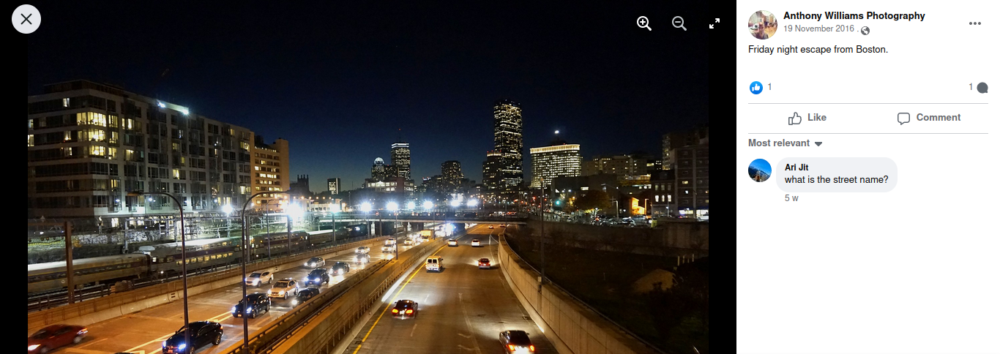
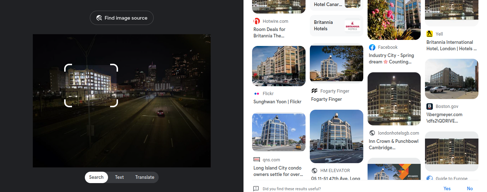
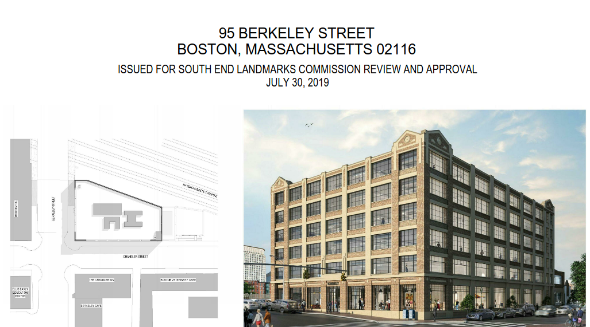
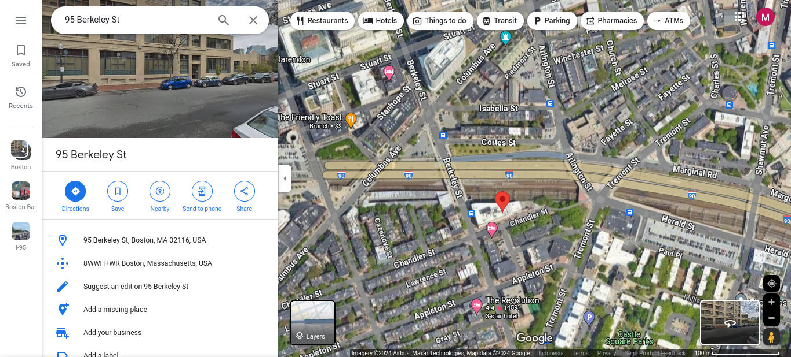
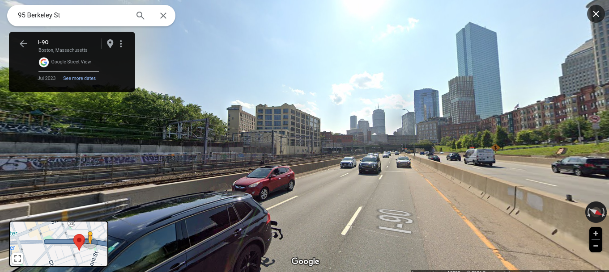
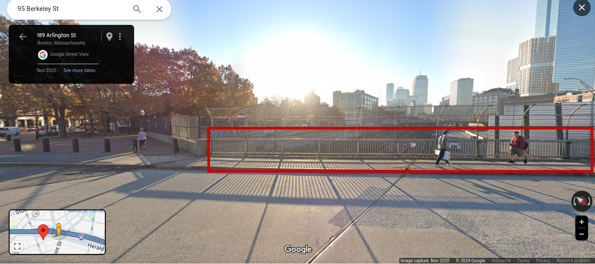

# Night

## Description

That was quite a pretty night view, can you find where I took it? Flag format: uiuctf{street name, city name} Example: uiuctf{East Green Street, Champaign}

Some words are blurred out to make the challenge harder, hopefully.

Flag format clarification: Use the full type, e.g. Avenue, Street, Road, etc., and include a space between the comma and city name.

## Attachment

[chal.jpg](./Challenge/chal.jpg)

## Solution

The first step to identifying the location for this photo is by using Google image reverse search. From this result, I found similar location on this [Facebook post](https://web.facebook.com/AnthonyWilliamsPhotographyandphortraits/photos/pb.100079999744837.-2207520000/1158177897563630/?type=3)

From this post, I just found a clue about the city name on that photo, which is Boston in Massachusetts. But, with only this clue we can't find the location in this photo. I try to narrowed down the search by selecting only a certain building in the photo and here's the result.

From the result there's a document by the government of Boston about this building. You can find the document on this [link](https://www.boston.gov/sites/default/files/imce-uploads/2019-08/2019-0730_95_berkeley-_south_end_landmarks_presentation.pdf). According to the document, this building is located at 95 Berkeley Street Boston.

Now, let's search 95 Berkeley Street on Google Maps. Based on the search result, it seems the highway on that photo is across the building at 95 Berkeley Street. Let's try to go to that location.

I got the right location of where the photo could be taken. From the information on Google Maps, this highway is called Interstate-90 or I-90. But when I submitted this as the street name for the flag, it's incorrect.

Maybe the street name for this challenge is not the the name of this highway, but the street name where the person actually took that photo. If we put ourselves in the position of photographer, this photo might be took at the street above the highway (look at the PoV of the photographer). From the search result of 95 Berkeley Street on Google Maps earlier, there're three street that exactly above the I-90 highway near the 95 Berkeley Street. They're Berkeley, Arlington, and Tremont Street. Judging by the position where the photographer took this photo, the Berkeley Street seems like not the location where the photographer took this photo because the building around where the photo was take will be different. It's left us with only 2 choices, Arlington Street or Tremont Street. I try to use streetview on Google Maps to the Arlington Street. By using streetview I found the location where the photographer took this photo. The photographer took this photo probably around the area with the red square. It means that the photographer took the photo at Arlington Street.

## Flag

`uiuctf{Arlington Street, Boston}`

