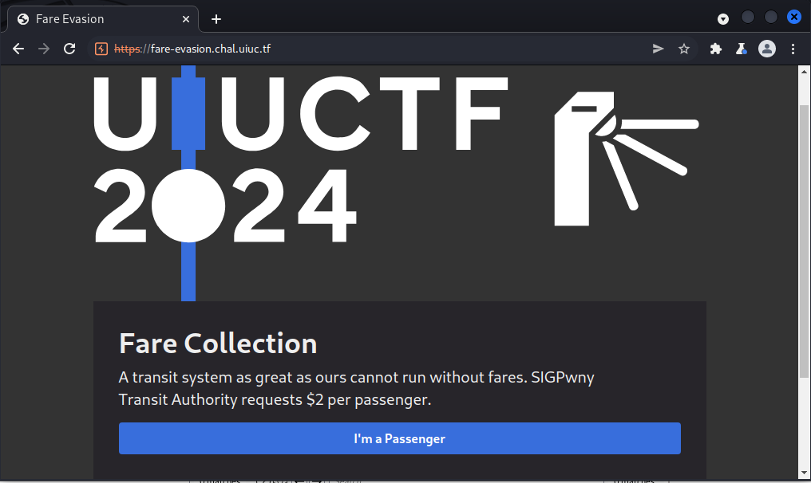
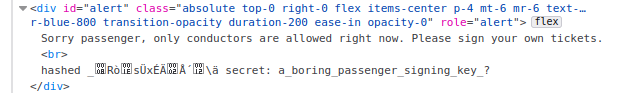
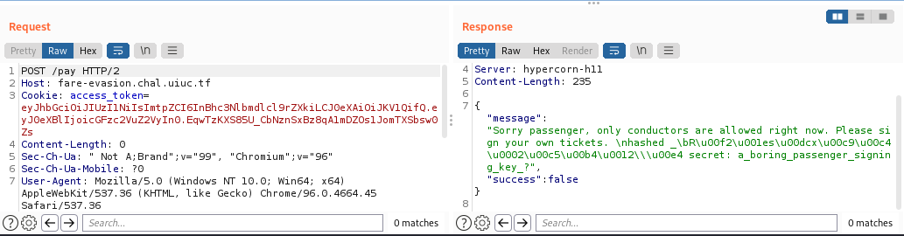
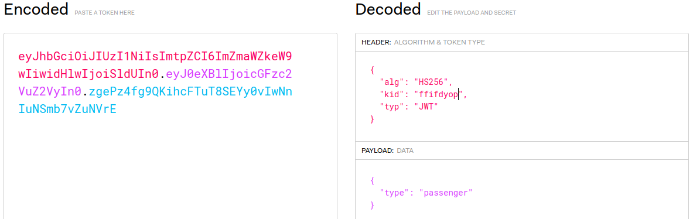
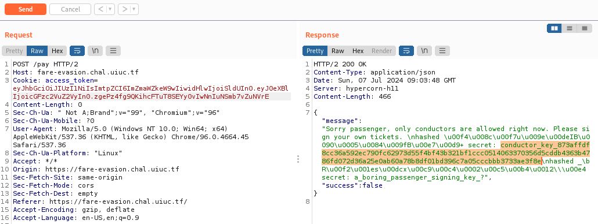
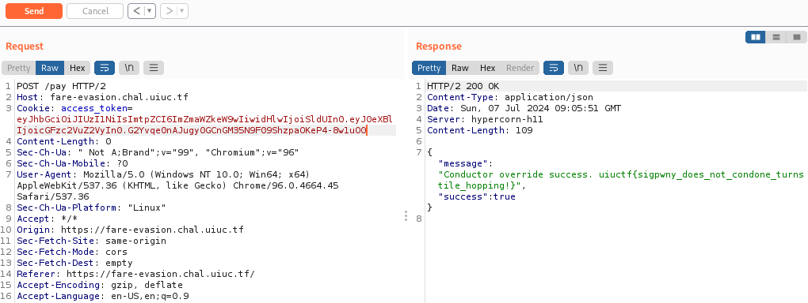

# Fare Evasion

## Description

SIGPwny Transit Authority needs your fares, but the system is acting a tad odd. We'll let you sign your tickets this time!

https://fare-evasion.chal.uiuc.tf/

## Solution

For this challenge there's no source code as attachment, but when I looked at the source code directly from the website there's some interesting Javascript code.

```js
    async function pay() {
      // i could not get sqlite to work on the frontend :(
      /*
        db.each(`SELECT * FROM keys WHERE kid = '${md5(headerKid)}'`, (err, row) => {
        ???????
       */
      const r = await fetch("/pay", { method: "POST" });
      const j = await r.json();
      document.getElementById("alert").classList.add("opacity-100");
      // todo: convert md5 to hex string instead of latin1??
      document.getElementById("alert").innerText = j["message"];
      setTimeout(() => { document.getElementById("alert").classList.remove("opacity-100") }, 5000);
    }
```

In that code, there's `pay()` function that make a request to `/pay` and we will get output return as a message alert.
But the interesting things are, we know that there's SQLite database by looking at this commented code:

```js
db.each(`SELECT * FROM keys WHERE kid = '${md5(headerKid)}'`, (err, row) => {
        ???????
```

That code is querying all available `kid` from `keys` table inside the database as MD5 hash.
This `kid` or key ID is often found at JSON Web Token (JWT), in which `kid` is an optional header that holds key identifier to verify the signature of JWT token.
I found the information about `kid` from this [link](https://stackoverflow.com/questions/43867440/whats-the-meaning-of-the-kid-claim-in-a-jwt-token).
Another interesting thing is the developer need to convert the MD5 hash to hex string instead of latin1. 
It means that the MD5 hash value will be printed as a raw string instead of hex string. To get the value of MD5 hash value as raw string we need to click the **I'm a Passenger** button.



This is how the output of the raw MD5 hash string and a secret for signing a passenger key.





We could see that the hashed value of MD5 is indeed in raw string format instead of hex. 
After searching about raw MD5 hash and SQL, I found this [Leet CTF writeup from Christian](https://cvk.posthaven.com/sql-injection-with-raw-md5-hashes).
From that writeup I will take a note some interesting information about using raw MD5 hashes.
> Raw MD5 hashes are dangerous in SQL statements because they can contain characters with special meaning to MySQL. The raw data could, for example, contain quotes (' or ") that would allow SQL injection.

That mean we can exploit this raw MD5 hash for SQL injection.
But the question is "how can I exploit the raw MD5 hash to inject malicious SQL query to the database?".
Then, I found another article about exploiting SQL injection via kid in JWT token from this [link](https://kurtikleiton.medium.com/json-web-token-exploitation-for-red-team-580eea1fe46a).
That's good, it means that we can forge the JWT token and insert a payload for SQL injection in `kid` header.
For that, I used this web https://jwt.io/ to forge the malicious JWT token.

To forge the malicious JWT token, first we need to copy the value of original JWT token from the website. You can find this in a cookies called `access_token`.
After copied the value of `access_token`, change the value of `kid` with `ffifdyop`. That `ffifdyop` will become SQL query like this using the value of its raw MD5 hash.

```
md5("ffifdyop", true) = 'or'6�]��!r,��b�
```

This is the payload for the SQL injection. You can find more payloads for SQL injection from this [reference](https://github.com/swisskyrepo/PayloadsAllTheThings/tree/master/SQL%20Injection#authentication-bypass-raw-md5-sha1)

After changed the value of `kid`, then we need to insert the secret to verify the signature of this JWT.
We've got the secret to verify ourself as passenger which is `a_boring_passenger_signing_key_?`. Copy the value of this JWT token to `access_token`.



Click the **I'm a Passenger** button again to see the result.
From this image we've succeeded send our SQL injection payload to the database and we can see the secret for conductor.



The value of conductor secret key is

```
conductor_key_873affdf8cc36a592ec790fc62973d55f4bf43b321bf1ccc0514063370356d5cddb4363b4786fd072d36a25e0ab60a78b8df01bd396c7a05cccbbb3733ae3f8e
```

Then our next step is to forge the JWT token using the secret key for conductor so we can get the message or flag as conductor.
From the last step of forging the malicious JWT token, we just need to change the secret key using secret key for conductor. 
After that copy the value of the newly forged JWT token into `access_token`.
The successful result will show us the flag for this challenge.



## Flag
`uiuctf{sigpwny_does_not_condone_turnstile_hopping!}`

